# Propositional Logic

> 命题逻辑

 ## Syntax 

> 语法 

命题变量的符号表示，命题常量，连接符号

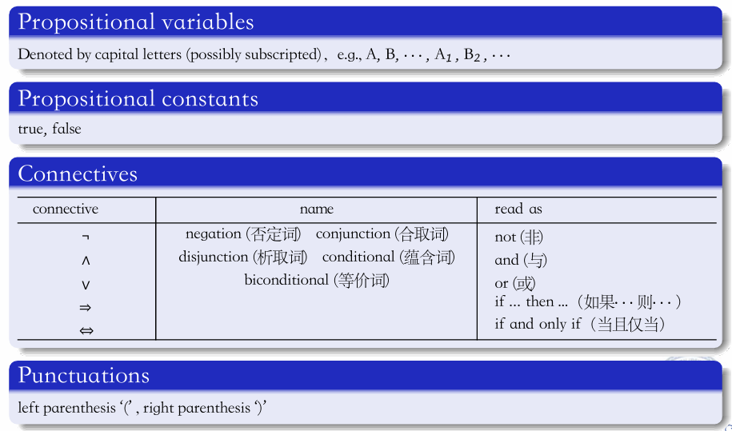
#### Order of precedence

 ¬, ∧, ∨, ⇒, ⇔

## Semantics

> 语义

#### Truth assignment

> 真假赋值

定义（真值赋值）

- **真值赋值 \*ν\***：这是一个函数，它将每个原子公式映射到一个真值，这些真值只能是 {*T*,*F*}，即真（True）或假（False）。
- **具体要求**：
  - $true^ν=T$：表示当公式为“真”时，其真值赋值为真（True）。
  - $false^ν=F$：表示当公式为“假”时，其真值赋值为假（False）。

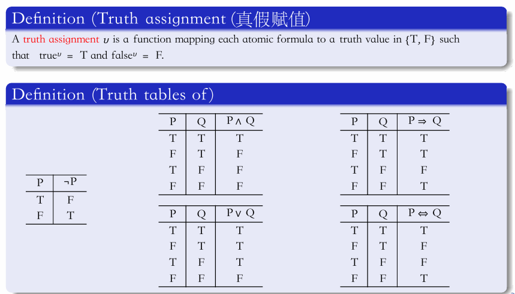
真值表如上

#### Tautology, contradiction and satisfiable formula

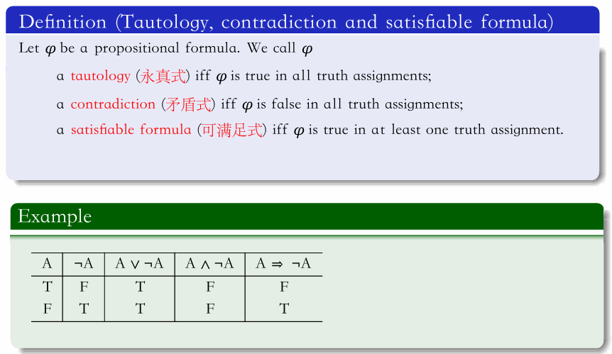
#### Tautological implication

> 重言式蕴含

定义（Tautological implication）

- **Σ**：表示一组公式。
- **ψ**：表示一个公式。
- 如果 **ψ** 在满足 **Σ** 的任何真值赋值下都为真，那么我们说 **Σ** 重言式地蕴含 **ψ**，或者等价地说，**ψ** 是 **Σ** 的一个重言式蕴含（逻辑推论），记作 **Σ ⊨ ψ**。
- 如果 **Σ = {φ₁, ..., φₖ}**，我们可以简单地写作 **{φ₁, ..., φₖ} ⊨ ψ** 作为 **φ₁, ..., φₖ ⊨ ψ**。

示例：

要求通过真值表证明两个逻辑蕴含关系：

1. **{A ⇒ B, A} ⊨ B**
2. **A ∧ B ⊨ A**

* 真值表

真值表列出了所有可能的 A 和 B 的组合，并计算了每个组合下 A ⇒ B、A ∧ B 和 {A ⇒ B, A} 的真值。

| A    | B    | A ⇒ B | A ∧ B | {A ⇒ B, A} |
| ---- | ---- | ----- | ----- | ---------- |
| T    | T    | T     | T     | T          |
| T    | F    | F     | F     | F          |
| F    | T    | T     | F     | T          |
| F    | F    | T     | F     | T          |

（其中**{...}**：大括号 `{}` 用来表示一组元素，在这里是指一组逻辑公式，当我们说 `{A ⇒ B, A}` 时，我们通常是指这两个公式的合取，等价于 `A ∧ (A ⇒ B)`）

#### Tautological equivalence

> 逻辑等价于

如果 *φ*⊨*ψ* 且 *ψ*⊨*φ* 都成立，那么我们说 *φ* 和 *ψ* 是逻辑等价的，记作 *φ*≡*ψ*。

举例：

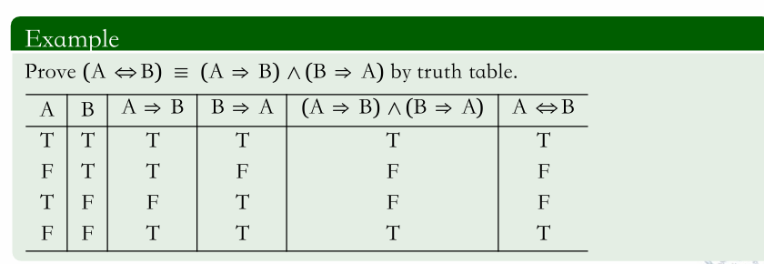
## Formal proof

> 形式化证明

### Deductive system

> 演绎系统

- **定义**：演绎系统提供了一种**句法方式**（syntactic way）来证明 Σ⊨*ψ*。这里的 Σ 表示一组前提（或假设），*ψ* 表示结论。
- **组成**：一个演绎系统由一组有限的推理规则组成，这些规则具有特定的形式。

### Inference rules

#### Inferencerule

> 推理规则

- **定义**：推理规则是演绎系统中的基本组成部分，用于从一组前提推导出结论。

- **形式**：每个推理规则具有以下形式：

  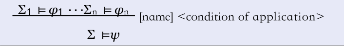
  - **上部分**：表示一组前提，每个前提都是一个形式为 Σi ⊨ φi的表达式，其中 Σ*i* 是一组前提，*φi* 是结论。
  - **下部分**：表示从这些前提推导出的结论 Σ⊨*ψ*，其中 Σ 是一组前提，*ψ* 是结论。
  - **方括号**：表示推理规则的名称。
  - **条件**：表示应用该推理规则的条件。

#### 规则举例

* 自反规则

  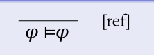
* 加法规则

  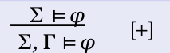
* 归谬法（或称反证法）

  Reductio ad Absurdum, [¬-]

  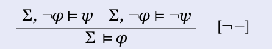
  **规则形式**：若 Σ,¬φ⊨ψΣ,¬*φ*⊨*ψ* 且 Σ,¬φ⊨¬ψΣ,¬*φ*⊨¬*ψ*，则 Σ⊨φΣ⊨*φ*

  **解释**：假设 ¬φ¬*φ* 会导致矛盾（ψ*ψ* 和 ¬ψ¬*ψ* 同时成立），则可推出原结论 φ*φ*。这是反证法的核心规则，通过否定结论导出矛盾来证明原命题为真。

  

  

* 合取消去规则[ ^ -]  合取引入规则 [ ^ +]
  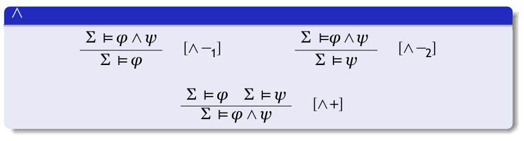
  

* 析取消去规则[ ∨ -]  析取引入规则 [ ∨ +]

  解释：
  若从前提集合 ΣΣ 可推出 φ*φ*，则可推出析取式 φ∨ψ*φ*∨*ψ*（规则 [∨+1]）；同理，若可推出 ψ*ψ*，则可推出 φ∨ψ*φ*∨*ψ*（规则 [∨+2]）。
  **示例**：
  若已知“今天下雨”，可推出“今天下雨或晴天”。

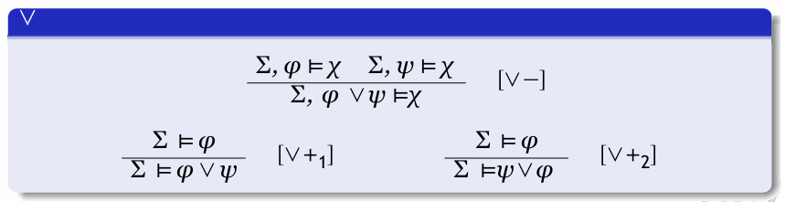

* 蕴含引入规则（⇒+）

  若从前提集合 Σ和假设A可推出 B，则从 Σ 可推出 A⇒B。

  - **关键点**：
    - 假设 *A* 是**临时添加到前提集合中**的额外假设。
    - 在推出 A*⇒*B 时，需**解除对 A 的依赖**，仅保留原始前提 Σ。

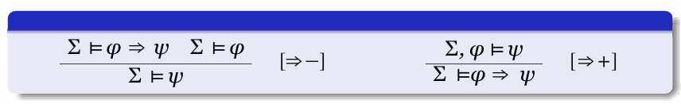

* 双条件消去规则[⇔-]  双条件引入规则[⇔+]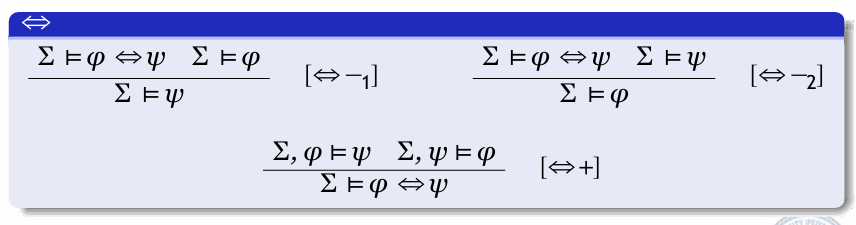  

* 前提引入规则
### Formal proof

#### 定义（形式证明）

- **Σ**：表示一组公式。
- **φ**：表示一个公式。
- **Σ ⊨ φ**：表示从一组公式 Σ 可以形式地证明公式 φ。

ppt中的定义说明，如果存在一个有限的公式序列 Σ1⊨*φ*1,Σ2⊨*φ*2,…,Σ*n*⊨*φ* *n*，满足以下条件：

1. 对于 *k*=1,…,*n*，每个 Σ*k*⊨*φ* *k* 都是通过之前介绍的某个推理规则从前一个公式序列 Σ1⊨*φ*1,…,Σ*k*−1⊨*φ* *k*−1 推导出来的。
2. Σ*n*=Σ，即最后一个公式序列与原始前提集相同。
3. *φ* *n*=*φ*，即最后一个公式是我们要证明的目标公式。

那么，这个序列就被称为 Σ ⊨ φ 的形式证明。

#### 举例

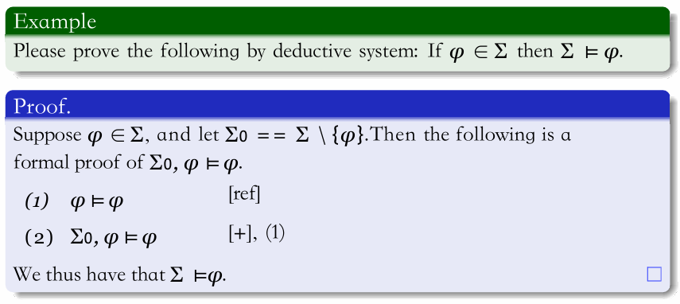
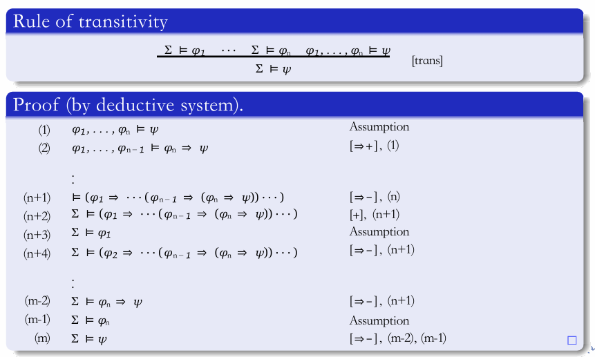
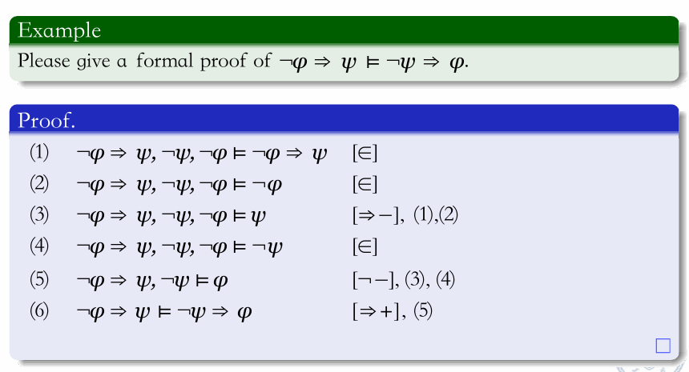
上图中逗号是分隔符，⊨ 前是题设，⊨ 后是结论。

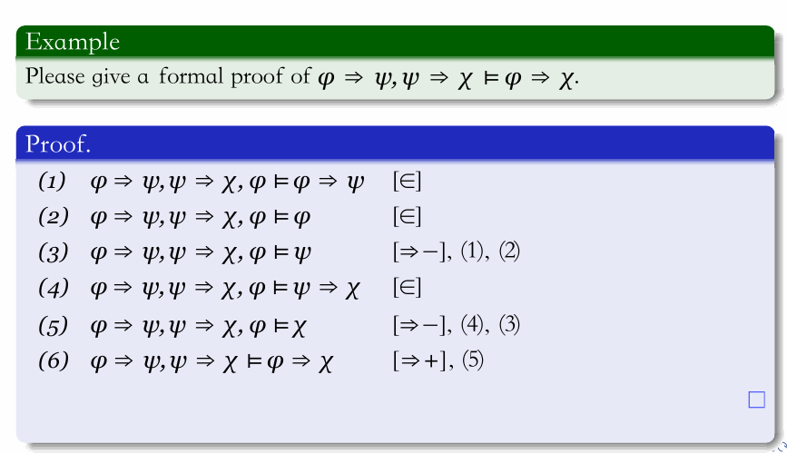
在题设中抄写题目条件，需要单条件命题用ref规则

在上题（6）中，用蕴含引入规则（⇒+）（若从前提集合 Σ和假设A可推出 B，则从 Σ 可推出 A⇒B。）

- 临时假设 A：*φ*

- 推导结果 B：χ

- **原始前提 Σ**：φ⇒ψ,ψ⇒χ

- 根据规则，解除对 *φ* 的假设，得到：

  φ⇒ψ,ψ⇒χ ⊨ φ⇒χ