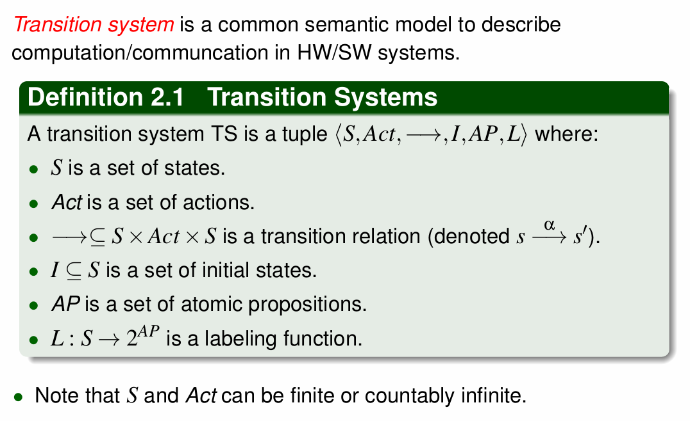
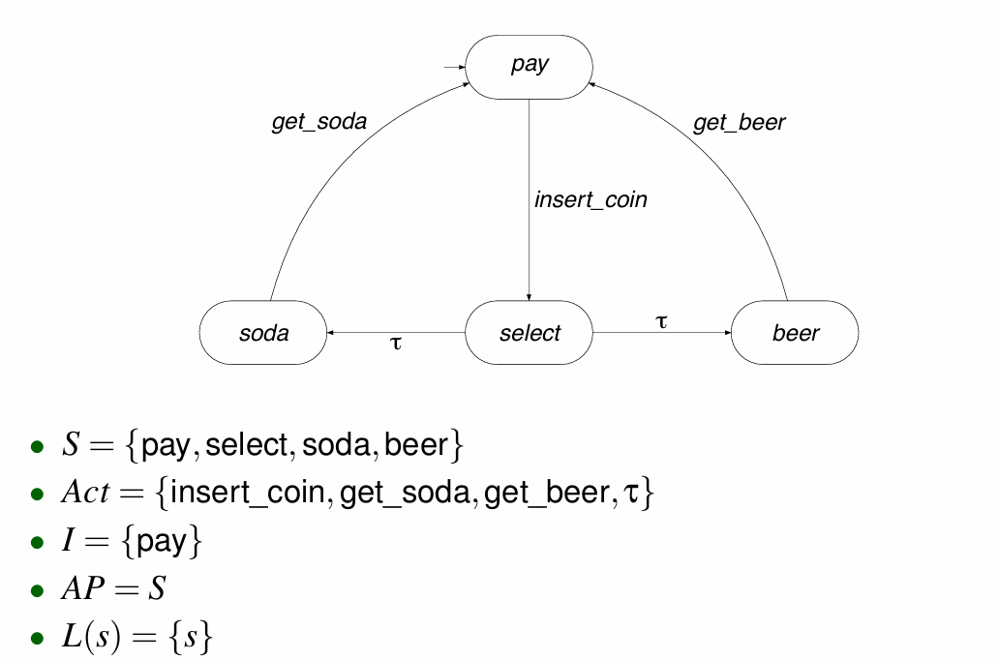
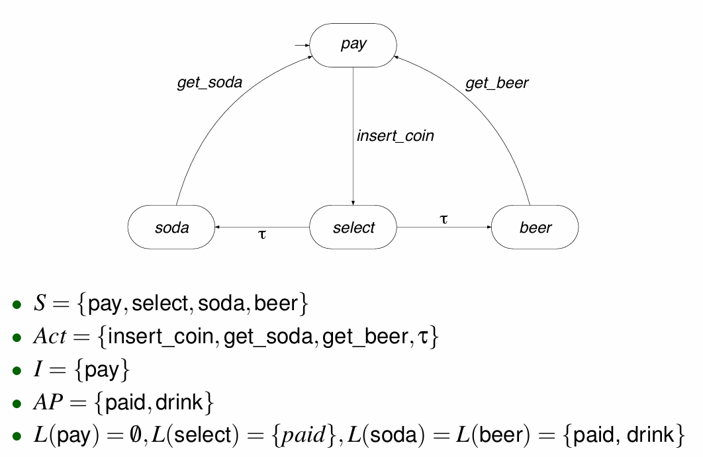
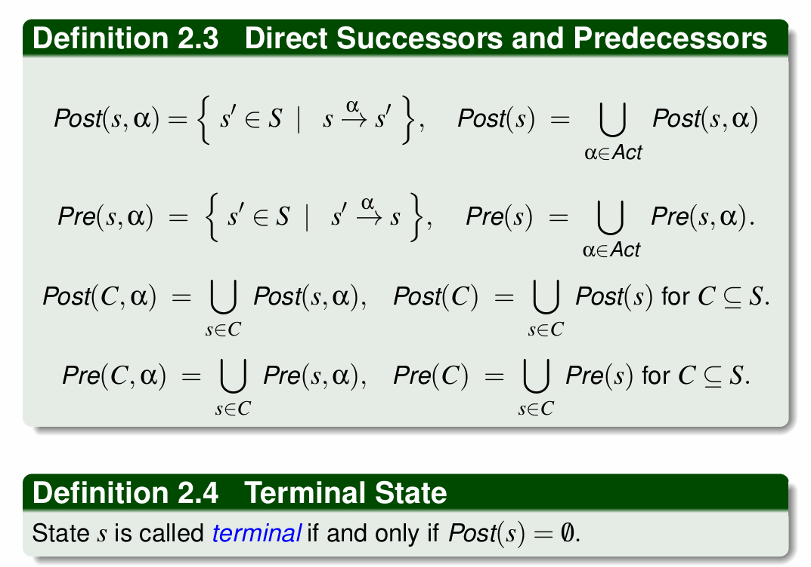
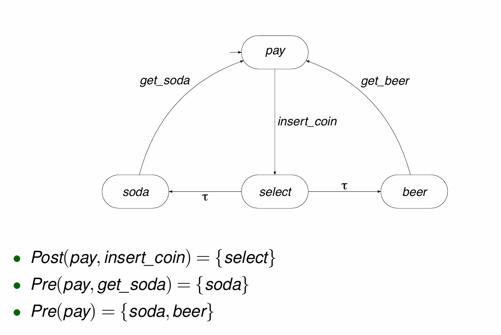
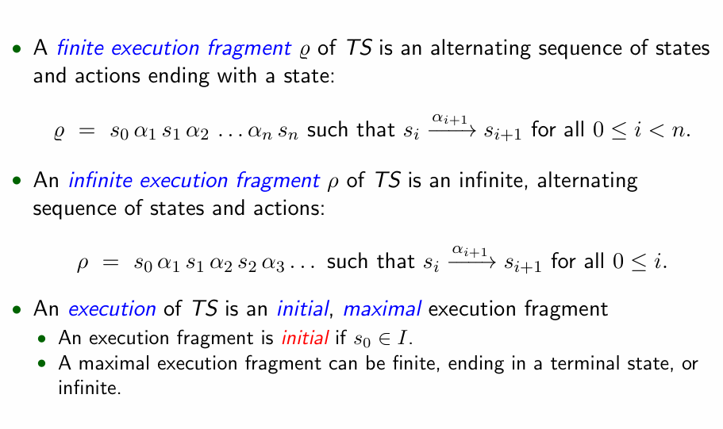
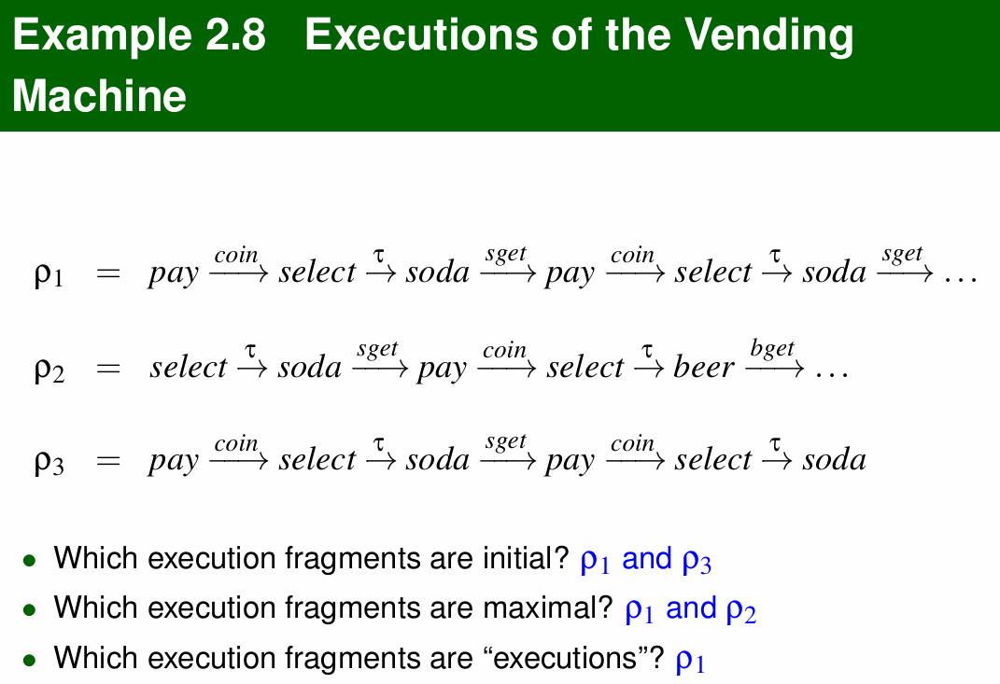

# Modeling Concurrent Systems

> 并发系统建模

## Modeling Formalisms

> 形式建模

###  Transition Systems

> 过渡系统

### Example Beverage Vending Machine

### Successors and Predecessors

> 后继任务和前任任务

* example

  
### execution

> 执行

执行 （run） 是状态转换的线性序列。用于描述转换系统的动态行为。

* finite execution fragment: TS 的有限执行片段是状态和操作的交替序列，以状态结尾：

* infinite execution fragment ：TS 的无限执行片段是状态和操作的无限交替序列：

* Maximal and Initial Execution：TS 的执行是一个初始的最大执行片段，即execution同时满足 initial和maximal。

  初始执行片段必须从系统的初始状态开始。

T最大执行片段无法进一步扩展，即要么是无限循环（如带省略号 `…` 的片段），要么终止于一个无法继续执行的状态。

* 如果 s0$\in$I,则执行片段是初始的。
  * 最大执行片段可以是有限的，以终止状态结束，也可以是无限的。

example：

解释：

1.初始（Initial）执行片段是第一个状态s0 在集合 $I$ 中：此题中为pay。

2.最大（Maximal）执行片段是无限循环或结束于终止状态：p1和p2都是无限循环，但p3不是终止状态，可以继续扩展，所以p3不是最大执行片段。

3.执行（execution） 需要同时满足initial, maximal。即1，2题的交集，所以只有p1满足条件。

