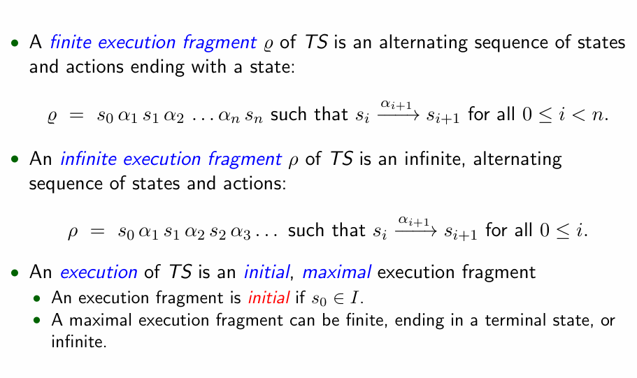
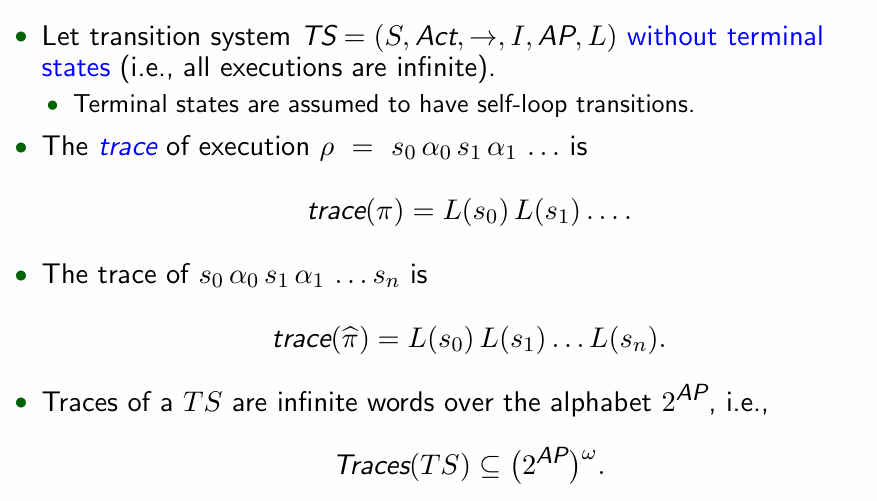
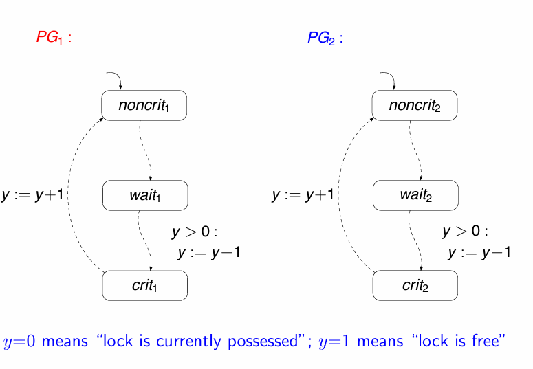
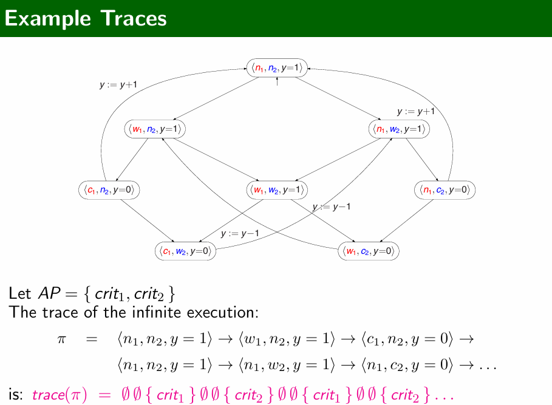
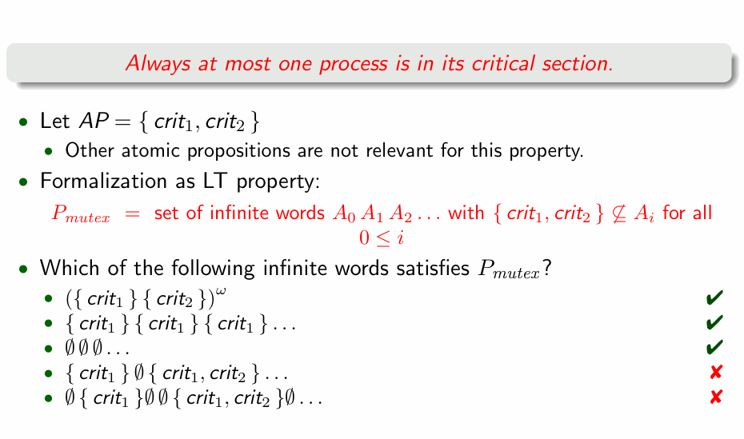
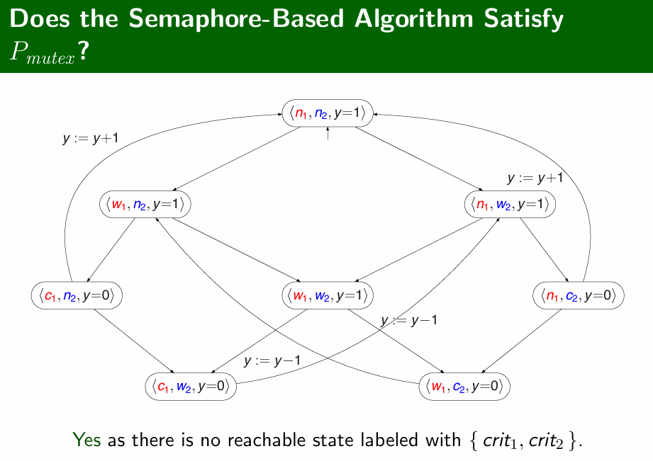
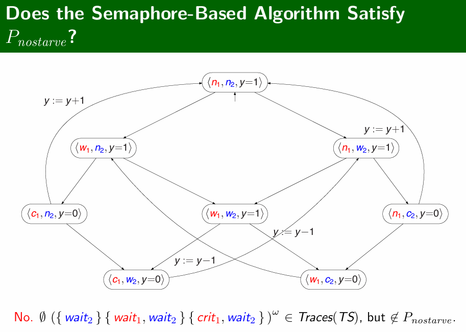

# Linear-Time Properties

> 线性时间属性

## Deadlock

example:

红绿灯问题：一个路口只允许一个绿灯出现

The Dining Philosophers：哲学家必须占有左右两边的资源才可以就餐

## Linear-time Properties

> 线性时间属性

### Recall Executions

见上节。

### Traces

transition system没有最终状态，executions都是无限的。

Terminal state 具有自环转换。

### Semaphore-Based Mutual Exclusion

> 基于信号量的互斥

 y=0占用  ; y=1  释放

 y=y-1占用  ; y=y+1  释放

### Example Traces

### How to Specify Mutual Exclusion?

确保在任何时刻，最多只有一个进程在其临界区。

在 { } 中的是同时进行的。

