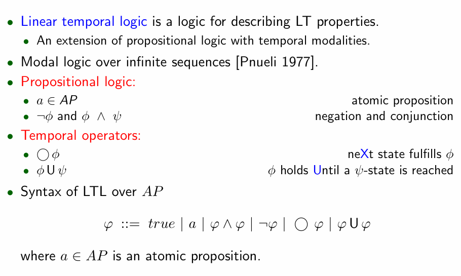
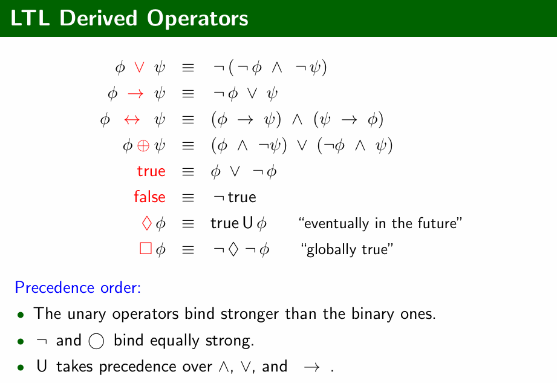
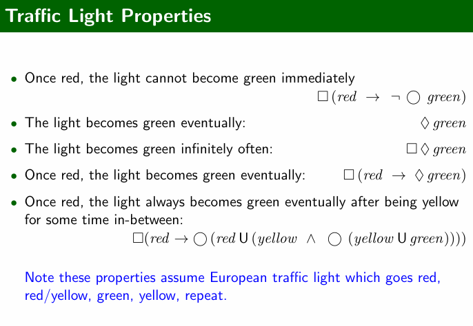
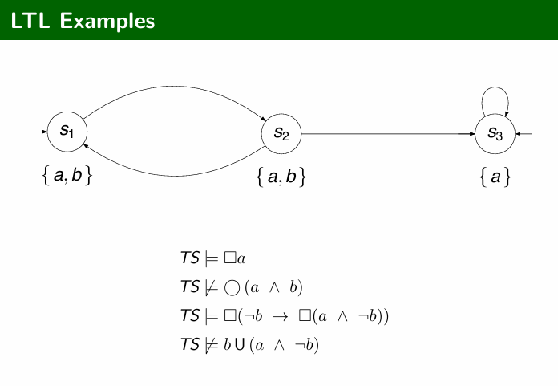

# Linear-Time Logic
**(这里要把这些符号搞明白 考试考了符号的含义)**

## Syntax & Semantics

> 语法和语义

### Syntax

1. **时间运算符**：

   - `◯φ`（Next）：下一个状态满足φ。
   - `φUψ`（Until）：φ持续到ψ状态被达到。

2. **LTL派生运算符**

   - `φ ∨ ψ` 表示 `¬(¬φ ∧ ¬ψ)`，逻辑或。

   - `φ → ψ` 表示 `¬φ ∨ ψ`，蕴含。

   - `φ ↔ ψ` 表示 `(φ → ψ) ∧ (ψ → φ)`，当且仅当。

   - `φ ⊕ ψ` 表示 `(φ ∧ ¬ψ) ∨ (¬φ ∧ ψ)`，异或。

   - `true` 表示 `φ ∨ ¬φ`，真。

   - `false` 表示 `¬true`，假。

   - `♦φ` 表示 `true U φ`，“最终在未来”。表示最终状态。

   - `□φ` 表示 `¬♦¬φ`，“全局真”。表示在所有后续状态中都保持为真。即φ 在未来是持续为真的。

     在操作系统中，`□φ` 可以表示“系统总是处于安全状态”

3. **优先级顺序**：

   - 一元运算符（如`¬`和`◯`）的优先级高于二元运算符。
   - `¬`和`◯`具有相同的优先级。
   - `U`的优先级高于`∧`、`∨`和`→`。

### Traffic Light Properties

最后一个：每次红灯后，保持红灯直到（`U`）变为黄灯，然后黄灯保持直到变绿。

总结：

只要有once就有`□` 

有eventually就有`♦` 

### LTL Examples

