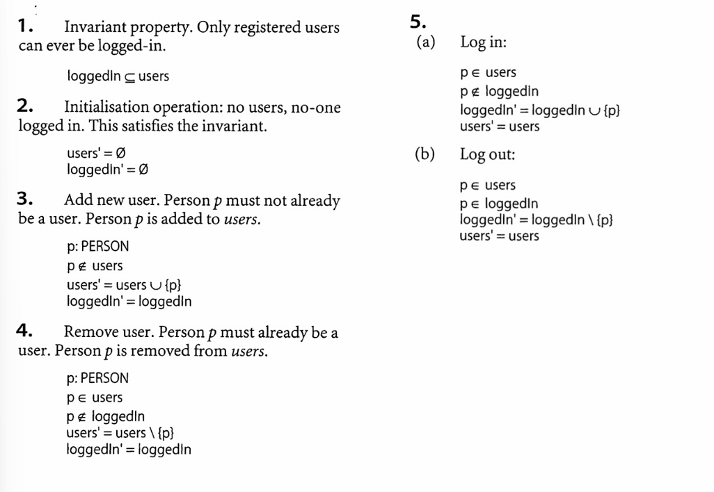

## Types in Z

### Typed set theory

> 类型化集合论

- 一个类型化的集合中的所有成员都被认为有相同之处，即有相同类型
- 类型避免了数学悖论、允许检查
- Z 以类型化的集合论为基础

### The built-in type Integer

> 内置类型整型

- 无需声明
- 写法：ZZ
- $+ - *$  div mod
- m .. n（m ≤ n）
  - 3 .. 5 = {3, 4, 5}

###  The standard type Natural

> 标准类型自然数（Natural）

- 整型子集，非负
- 写法：NN
- N1：除了零之外的自然数

### Numerical relations

> 数字关系

- = ≠ < ≤ > ≥

### Basic (Given) types

> 基础（Basic、Given）类型

- 无需考虑实际是怎样表示的
- 写法：[name] comment
- 举例：[PERSON] the set of all people

### Free types

> 自由（Free）类型

- 列出元素的标识符
- 写法：$freeType ::= element_1 | element_2 | ... element_n$

## Variables in Z

### Declarations of variables

> 变量的声明：

* 引入值
* 说明它所指的值类型

写法：v:TYPE，即 v 是 TYPE 类型的值的集合的一个元素（v 是集合 TYPE 的一种描述）（v 是一种 TYPE）

举例：chauffeur: PERSON

### Values of sets

> 集合的值：

- 用花括号列出

### Validity of membership test

> 同一类型的值判断是否是集合的成员

要测试成员资格的值必须是集合的基础类型的元素，否则，测试既不是 true 也不是 false，而是非法的。

### Size (cardinality) of a set

> 集合的大小（势）：

- 元素个数
- 写法：# set
- 举例：# $\varnothing$ = 0

###  Powersets

> 幂集：

- 写法：S 的 幂集为 *P*S
- $\#PS = 2^{\#S}$

### Difference

> 差：

- 除去部分元素
- 写法：S \ T

### Distributed union and intersection

> 并、交

###  Partition

> 划分：

- 分割、不重合、并起来是原集合

# * 举例：使用集合描述一个系统

情景：

- 乘客登机

约束：

- 无座位号、FCFS、固定容量

假设：

- 人不同

基本类型：

- [PERSON]

变量：

- capacity: N 飞机的座位容量
- onboard: *P*PERSON 飞机系统的状态

不变的属性：

* #onboard ≤ capacity

初始化操作：

- onboard' = $\varnothing$

登机操作：

* p: PERSON 

  p $\notin$ onboard

  onboard < capacity

  onboard' = onboard $\cup$ {p}

下机操作：

- p: PERSON

  p $\in$ onboard 

  onboard' = onboard \ {p}

查询：

- 登机人数

  numOnboard: N 

  numOnboard = # onboard 

  onboard' = onboard

* 登机乘客 

  RESPONSE ::= yes | no 

  p: PERSON 

  reply: RESPONSE 

  ((p $\in$ onboard and reply = yes) or (p $\not\in $onboard and reply = no)) 

  onboard' = onboard

# * 举例：使用集合和逻辑运算符描述一个系统

RESPONSE ::= OK | twoErrors | onBoard | full | notOnBoard

登机操作：

- p: PERSON

  reply: RESPONSE 

  (p $\not\in$ onboard $\wedge$ # onboard < capacity $\wedge$ onboard' = onboard $\cup$ {p} $\wedge$ reply = OK) 

  $\vee$ 

  (p $\in$ onboard $\wedge$ # onboard = capacity $\wedge$ onboard' = onboard $\wedge$ reply = twoErrors) 

  $\vee$ 

  (p $\in$ onboard $\wedge$ # onboard < capacity $\wedge$ onboard' = onboard $\wedge$ reply = onBoard) 

  $\vee$ 

  (p $\not\in$ onboard $\wedge$ # onboard = capacity $\wedge$ onboard' = onboard $\wedge$ reply = full)

下机操作：

- p: PERSON 

  reply: RESPONSE

   (p $\in$ onboard $\wedge$ onboard' = onboard \ {p} $\wedge$ reply = OK)

   $\vee$

   (p $\not\in$ onboard $\wedge$ onboard' = onboard $\wedge$ reply = notOnBoard)

# * 举例：使用集合描述用户状态

