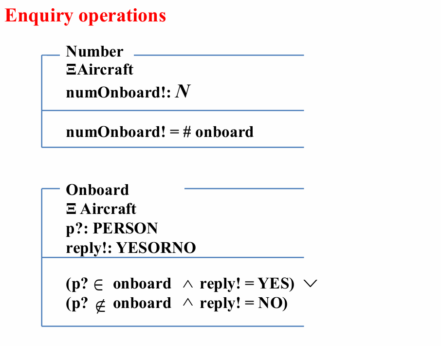

# Schema（模式）

## Schemas

Schema：结构化的规格说明

schema 的图表形式：

- schema 名称、声明、谓词

```
|--- Schema Name ---
|    Declarations
|-------------------
|    Predicate
|___________________
```

schema 的文字形式：

- SchemaName == [ Declarations | Predicate ]
- == 即“代表”

声明和谓词：

- 每行声明被视为以分号结束，若干行构成一个序列
- 若干行谓词被视为以运算符连接

匿名模式：

- 没有名称

不含谓词部分的模式：

- 只声明新变量，不施加约束谓词

局部变量：

- 模式里声明的变量，在其他模式里引用时需要明确包含定义的模式

全局变量：

- 在规格说明始终可以引用，以公理定义声明
- 值不能被规格说明运算改变

全局变量的公理定义：

```
| Declarations

| Declarations
|--------------
| Predicate
|
```

## Schema Calculus

> 模式推演

模式推演：

- 模式可以作为单元，被不同的类似逻辑运算符的运算符操作。

### 模式运算符:

####  Decoration 

> 修饰

* S 的修饰：S'，其中所有变量都变成对应的 '（a——a'）

- 表示一个模式在执行了某些操作后的值
- 写法：

```
|--- S       ---
|    a, b: N
|---------------
|    a < b
|---------------

|--- S'      ---
|    a', b': N
|---------------
|    a' < b'
|---------------
```

####  Inclusion 

- > 包含 Inclusion

  - 一个模式的声明可以包含另一个模式，被包含的模式的声明合并过来、谓词 conjoin 一起
  - 写法：

  ```
  |--- IncludeS  --
  |    c: N
  |    S
  |----------------
  |    c < 10
  |----------------
  ```

  表示

  ```
  |--- IncludeS  --
  |    c: N
  |    a, b: N
  |----------------
  |    c < 10
  |    a < b
  |----------------
  ```

####  Conjunction 

- > 合取 Conjunction

  - 两个模式 and，得到一个新模式，其声明是原来两个模式的合并（merge）、谓词是原来两个模式的与（$\wedge$，conjoin）

####  Disjunction 

- > 析取 Disjunction

  - 两个模式 or，得到一个新模式，其声明是原来两个模式的合并（merge）、谓词是原来两个模式的或（$\vee$，disjoin）

####  Delta convention 

- 或（$\vee$，disjoin）

- $\Delta$ Delta convention

  - 表示模式的改变：

  ```
  |--- \\Delta S  ---
  |    a, b: N
  |    a', b': N
  |-----------------
  |    a < b
  |    a' < b'
  |-----------------
  ```

####  Xi convention 

- $\Xi$ Xi convention

  - 和 $\Delta$ 一样，只不过每个变量的新值和旧值一样：

  ```
  |--- \\Xi S  ---
  |    a, b: N
  |    a', b': N
  |-----------------
  |    a < b
  |    a' < b'
  |    a = a'
  |    b = b'
  |-----------------
  ```

####  Renaming 

- > 重命名 Renaming

  - 语法：newSchemaName == oldSchemaName [newName1/oldName1, newName2/oldName2, ...]
  - 举例：T == S [c / b]（把 S 中的 b 替换成 c，得到 T）

  ```
  |--- T       ---
  |    a, c: N
  |---------------
  |    a < c
  |---------------
  ```

####  Hiding 

- > 隐藏 Hiding

  - 隐藏声明中的变量，让它只存在于谓词的运算符中
  - 语法：newSchemaName == oldSchemaName \ (varName1, varName2, ...)
  - 举例：Bhidden == S \ (b)

  ```
  |--- BHidden  --------
  |    a: N
  |---------------------
  |    存在b: N · a < b
  |---------------------
  ```

####  Projection 

- > 投影 Projection

  - 隐藏除指定变量之外的变量
  - 语法：newSchemaName == oldSchemaName $\uparrow$ (varName1, varName2, ...)
  - 举例：Aprojected == S $\uparrow$ (a)

  ```
  |--- AProjected  --------
  |    a: N
  |---------------------
  |    存在b: N · a < b
  |---------------------
  ```

####  Composition

- > 合成 Composition

  - 语法：S ; T

  - 表示执行 S 后执行 T，隐藏了中间变量

  - 举例：

    

    其中 column' 代表下一状态的列，line' 代表下一状态的行。

## 输入和输出变量

输入变量：

- 变量名 + ?

输出变量：

- 变量名 + !

举例：

```
|--- Add       -----
|    a?, b? : N
|    sum! : N
|-------------------
|    sum! = a? + b?
|-------------------
```

# 有输入的模式举例

## 有输入的模式举例

```
定义键类型
KEY ::= home | return | left | right | up | down
定义行数、列数
| numLines : N                   类型
| numColumns : N
|----------------
| 1 <= numLines                  约束
| 1 <= numColumns
游标
|-- Cursor    -----------------
|   line : N                     类型
|   column : N
|------------------------------
|   line \in 1 .. numLines       约束
|   column \in 1 .. numColumns
|------------------------------
Home 键
|-- HomeKey    ----------------
|   \Delta Cursor                Cursor 状态改变
|   key? : KEY                   输入变量 key 类型为 KEY
|------------------------------
|   key? = home                  操作
|   line' = 1
|   column' = 1
|------------------------------
正常向下键（正常向上键同理）
|-- DownKeyNormal    ----------
|   \Delta Cursor                Cursor 状态改变
|   key? : KEY                   输入变量 key 类型为 KEY
|------------------------------
|   key? = down                  操作
|   line < numLines              约束（正常向下）
|   line' = line + 1             行加一
|   column' = column             列不变
|------------------------------
在底部向下键（在顶部向上键同理）
|-- DownKeyAtBottom    --------
|   \Delta Cursor                Cursor 状态改变
|   key? : KEY                   输入变量 key 类型为 KEY
|------------------------------
|   key? = down                  操作
|   line = numLines              约束（在底部向下）
|   line' = 1                    行回到 1
|   column' = column             列不变
|------------------------------
换行键
|-- ReturnKey    ------------------------------
|   \Delta Cursor                                Cursor 状态改变
|   key? : KEY                                   输入变量 key 类型为 KEY
|----------------------------------------------
|   key? = return                                操作
|   column' = 1                                  列回到 1
|   ((line < numLines \wedge line' = line + 1)   还没到底部 行数加 1
|   \vee
|   (line = numLines \wedge line' = 1))          到底部了 行回到 1
|----------------------------------------------
向右键（向左键同理）
|-- RightKey    ----------------------------------------------------------
|   \Delta Cursor                                                           Cursor 状态改变
|   key? : KEY                                                              输入变量 key 类型为 KEY
|-------------------------------------------------------------------------
|   key? = right                                                 操作
|   ((column < numColumns \wedge column' = column + 1 \wedge line' = line)   还没到最右侧 列数加 1 行数不变
|   \vee
|   (column = numColumns \wedge column' = 1 \wedge           到最右侧了 列回到 1
|       ((line < numLines \wedge line' = line + 1)          还没到底部 则行数加 1
|       \vee
|       (line = numLines \wedge line' = 1))))                 到底部了 则行回到 1
|-------------------------------------------------------------------------
游标控制键
CursorControlKey == HomeKey $\vee$ ReturnKey $\vee$ LeftKey $\vee$ RightKey $\vee$ UpKey $\vee$ DownKey
```


## Overall Structure of a Z Specification Document

> Z 规范文档的整体结构

 ### Sections 

* Introduction.

  schema的说明

* **The types used in the specification. **

  规范中使用的类型

* **The state and its invariant properties. **

  状态及其不变属性

* **An operation to set the variables to some initial state. **

  将变量设置为某个初始状态的操作

* **Operations and enquiries. **

  要求实现的各种操作和查询

* Error handling. 

  错误处理

* Final versions of operations and enquiries.

  操作和查询的最终版本

# *举例：Aircraft系统

* types

  类型：

  - 集合 [PERSON]
  - 变量（基本、自由）


* state 

  状态：

  - 声明系统的变量（取子集）
  - 约束


* Initialization

  初始化：

  - 到下一状态
  - 空集


* operations

  操作：

  - 每一种操作对应系统的状态改变 $\Delta$（系统变量改变）
  - 声明输入 ? 变量
  - 变量约束、次态变量操作


* Enquiry operations

  查询：

  - 每一种查询对应系统的状态改变 $\Xi$（系统变量不变）
  - 声明输入 ? 输出 ! 变量
  - 对应输入变量，赋值给输出变量
  - 不同情况用 $\vee$ 连接，同一情况用 $\wedge$ 连接



* Dealing with errors

  错误处理：

  - 发生错误时对应系统的状态改变 $\Xi$（系统变量不变）
  - 声明输入 ? 输出 ! 变量
  - 根据特定输入，列出各种可能出错的情况，对应输出


* Final version of operations

  最终：

  - 对于正常情况，定义 OKMessage，其 reply 为 OK
  - 操作 == (初始情况 $\wedge$ OKMessage) $\vee$ 错误情况

