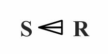
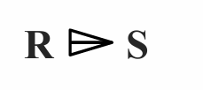
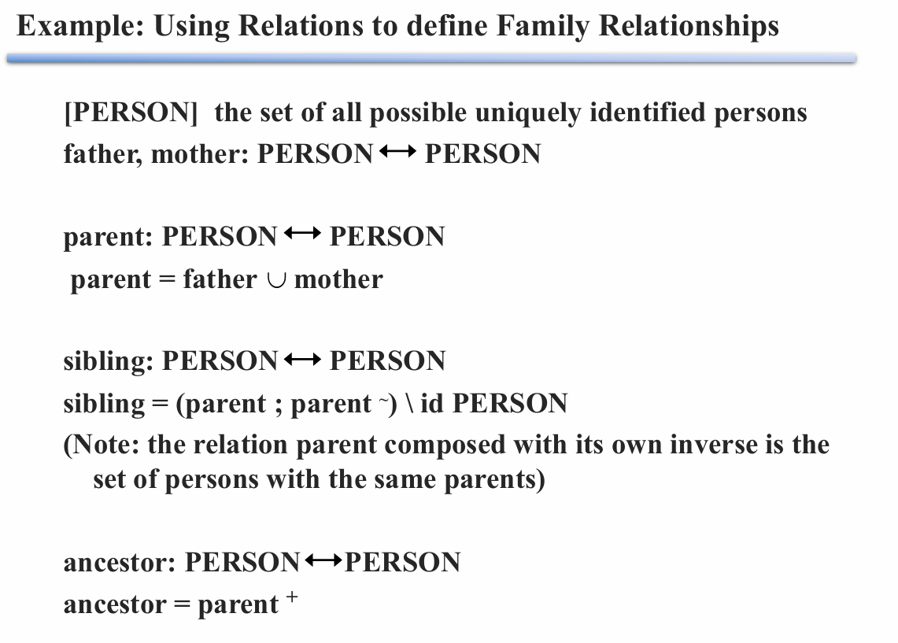
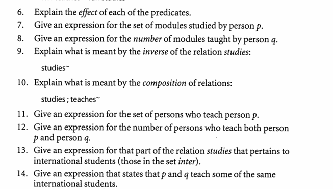
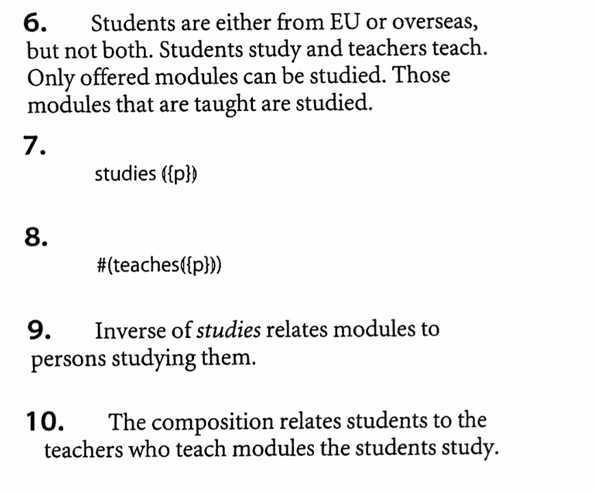
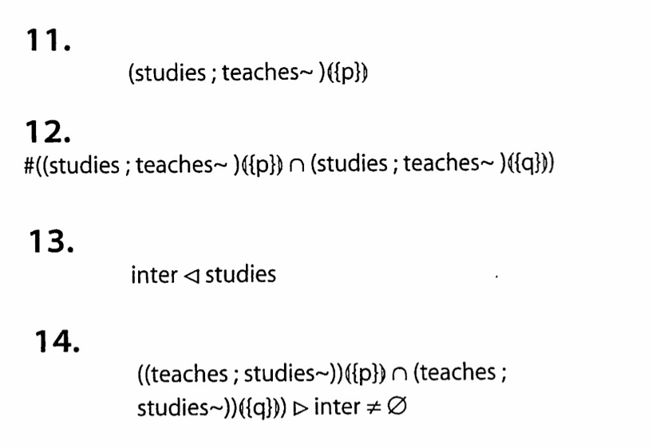

# Predicates and Quantifiers in Z

### Predicates

> 谓词

- 0-ary predicates(零元谓词)：命题，事实的陈述，独立于单个变量
- Unary predicates(一元谓词)：对象（个体）的特性
- Binary predicates(二元谓词)：一对对象（个体）的关系，n 元谓词就是 n 组对象（个体）之间的关系

### Quantifiers

> 量词

#### Universal quantifier $\forall$ (全称量词 )

- $\forall$ declaration | constraint · predicate
- declaration 给出一些变量，constraint 约束为确定的值，对于所有值谓词都为真
- | constraint 可省

####  Existential quantifier $\exist$ (存在量词)

- $\exist$ declaration | constraint · predicate
- 对于一些值谓词为真

#### Unique quantifier $\exist_1$ (唯一量词)

* 只存在一个值使得谓词为真

#### Counting quantifier (计数量词)

- 使谓词为真的值的个数，集合的大小

###  Set comprehension

> 集合推导

- 通过给定条件（谓词）来定义集合
- 形式：{declaration | constraint · expression}
- 举例：
  - {x: Z | Even(x) · x * x} 偶数的平方的集合
  - {x: Z · x * x} 整数的集合

# Relations in Z

### Declaring a relation

- source（from-set）$\leftrightarrow$ target（to-set）

- 类型集合 X 到类型集合 Y 的关系：R: X $\leftrightarrow$ Y（X $\leftrightarrow$ Y == *P*(X $\times$ Y)）

- 举例：

  [COUNTRY] 国家集合 

  [LANGUAGE] 语言集合

   speaks: COUNTRY $\leftrightarrow$ LANGUAGE

### Maplets

- maplet x $\rightarrow$ y == (x, y) 意为 x 和 y 有关（x is related to y，x map to y）
- x R y == x $\rightarrow$ y $\in$ R == (x, y) $\in$ R
- 举例：GB $\rightarrow$ English $\in$ speaks == (GB, English) $\in$ speaks

### Domain and Range of a relation

> 关系的域 Domain 和范围 Range（定义域、值域）

- R: X $\leftrightarrow$ Y（X $\leftrightarrow$ Y == *P*(X $\times$ Y)）
- dom R == {a | ($\exist$b)((a, b) $\in$ R)}, dom R $\subseteq$ X
- ran R == {b | ($\exist$a)((a, b) $\in$ R)}, ran R $\subseteq$ Y

### Relational image

- R(|S|)：S 在关系 R 下的像，S 在 R 中关系的像
- S 是 R 定义域的子集，R(|S|) 是 S 对应的值的集合，是 R 值域的子集

### Infix relations

> 中缀关系

其实指的就是两个元素之间书写的关系符号，比如说 + ，- 等这些都是常见的中缀关系符号。

- 写法：_ R _ : X $\leftrightarrow$ Y
- 举例： *speaks*: COUNTRY $\leftrightarrow$ LANGUAGE GB speaks English

### Inverse of a relation

- R 的反转：R~
- 举例：if x R y then y R~ x

# * 使用关系的举例

```
[COUNTRY] 所有国家的集合
[DATE] 日期
假期
|-- Hols   --------------------------------
|   holidays: COUNTRY \leftrightarrow DATE
|------------------------------------------
REPLY ::= yes | no
查询
|-- Enquire    -----------------------------------
|   \Xi Hols                                        状态改变 变量不变
|   c?: COUNTRY                                     输入
|   d?: DATE                                        输入
|   rep!: REPLY                                     输出
|-------------------------------------------------
|   ((c?, d?) \in holidays \wedge rep! = yes)\vee   关系在集合里 是
|   ((c?, d?) \not\in holidays \wedge rep! = no)    关系不在集合里 不是
|-------------------------------------------------
增加假期
|-- Decree    --------------------------
|   \Delta Hols                           状态改变 变量改变
|   c?: COUNTRY                           输入
|   d?: DATE                              输入                                    输出
|---------------------------------------
|   holidays' = holidays \cup {(c?, d?)}  变量集合并上输入的
|---------------------------------------
废除假期
|-- Abolish    --------------------------
|   \Delta Hols                           状态改变 变量改变
|   c?: COUNTRY                           输入
|   d?: DATE                              输入                                    输出
|---------------------------------------
|   holidays' = holidays \ {(c?, d?)}     变量集合去除输入的
|---------------------------------------
查询某一国家的假期
|-- Dates   ---------------
|   \Xi Hols                 状态改变 变量不变
|   c?: COUNTRY              输入国家
|   ds!: PDATE               输出日期的子集
|--------------------------
|   ds! = holidays(|{c?}|)   输入国家的集合在关系 holidays 下的像
|--------------------------
```

## 其他关系

### Domain restriction

定义域 Domain 限制：

- S $\lhd$ R（S <| R）：关系 R 的定义域限制在 S 内

###  Range restriction

值域 Range 限制：

- R $\rhd$ S（R |> S）：关系 R 的值域限制在 S 内

###  Domain subtraction

定义域 Domain 去除 subtraction：

- S <+ R：关系 R 的定义域去除掉 S (符号如下：)

  

### Range subtraction

值域 Range 去除：

- R +> S：关系 R 的值域去除掉 S



举例：

- EU: PCOUNTRY 

  EU $\lhd$ holidays 欧盟国家到他们的假期 

  EU <+ holidays 非欧盟国家到他们的假期

- summer: PDATE

  holidays $\rhd$ summer 国家到夏天的假期

  holidays +> summer 国家到非夏天的假期

## Composition

> 组合

### Forward composition：

顺序继承

- R: X $\leftrightarrow$ Y
- Q: Y $\leftrightarrow$ Z
- R ; Q: X $\leftrightarrow$ Z

### Backward composition：

逆顺序继承

* 

### repeated composition：

重复合成

- R: X $\leftrightarrow$ X（x R x）
- R ; R: X $\leftrightarrow$ X（x R$^2$ x）
- 总的来说  $x  R^+  y$  表示联系x，y的关系R中有repeated composition

## Identity relation

> 恒等关系 

id X == {x: X · x $\rightarrow$ x}

## Transitive closure

> 传递闭包 

传递闭包 R$^+$：x R$^+$ y（x 到 y 有 repeated composition）

## Reflexive Transitive closure

> 自反传递闭包

repeated composition = R$^*$ = R$^+\cup$ id X 包含恒等关系。

x R$^*$ x 永真，即使 x R x 为假。

# * 举例使用关系定义家庭关系



[PERSON] 人

父子（女）关系、母子（女）关系

father, mother: PERSON $\leftrightarrow$ PERSON

父母和子女的关系

parent: PERSON $\leftrightarrow$ PERSON

parent = father $\cup$ mother

兄弟姐妹关系（父母的子女，即 parent 的反关系，最后除去自身到自身）

sibling: PERSON $\leftrightarrow$ PERSON

sibling = (parent ; parent~) \ id PERSON

长辈关系（父母、父母的父母……）

ancestor: PERSON $\leftrightarrow$ PERSON

ancestor = parent$^+$

# * 例题





