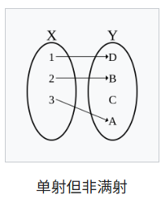
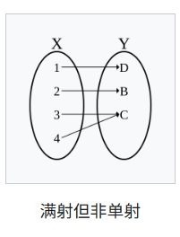
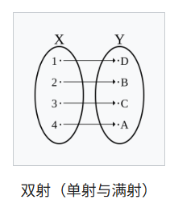
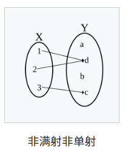

# Functions in Z

### Function

> 函数：

- 特殊的关系，一对一或多对一
- 定义域有限的函数也叫映射（mapping）
- 写法：f: X +$\rightarrow$ Y（从 X 到 Y 的函数）
- 当 x $\in$ dom f 且最多只对应一个 y 时，其等价于关系 f: X $\leftrightarrow$ Y x $\in$ dom f $\Rightarrow$ $\exist_1$y: Y · x f y

###  Function application

> 函数应用：

- f x

### Partial functions

> 部分函数 Partial functions：

- source 不全在 domain 中（source > domain）

### Total functions

> 全函数 Total functions：

- source 全在 domain 中（source ≤ domain）确保了函数的每一个输入都有输出，没有遗漏。
- 部分函数加上 dom f = X 的约束
- 写作：f: X $\rightarrow$ Y
- * 全函数只要求每个输入都有输出，不要求输出的唯一性。单射要求每个输入映射到不同的输出，但不要求每个输入都有输出。

### Injection

> 单射 Injection：

- domain 是整个 target

- 一对一

- 部分函数：f: X >+$\rightarrow$ Y

- 全函数：f: X >$\rightarrow$ Y

  

###  Surjection

> 满射 Surjection：

- range 是整个 target
- 部分函数：f: X +$\rightarrow$> Y
- 全函数：f: X $\rightarrow$>Y



### Bijection

> 双射 Bijection：

- 单射+满射
- f: X >$\rightarrow$> Y



### 非满射非单射



### Overriding

> 函数重写 Overriding：

- 指定函数定义域的子集，在对应的值域赋予新的值
- f: X +$\rightarrow$ Y g: X +$\rightarrow$ Y f 被 g 重写为新的函数 f $\oplus$ g：
  - f $\oplus$ g == (dom g $Domain subtraction$ f) $\cup$ g（g的定义域去除掉 dom f，再并上 g）
  - 当 x 在 f 的定义域中而不在 g 的定义域中时，f $\oplus$ g x = f x
  - 当 x 在 g 的定义域中时，f $\oplus$ g x = g x

# * 举例：使用函数描述存货控制

Example: Using Functions to Describe stock Control

```
[ITEM] 所有物品种类的集合
仓库 (state)
|-- Warehouse  ---------
|   carried: PITEM        拿的物品 是子集
|   level: ITEM +-> N     级别 物品到自然数的函数
|-----------------------
|   dom level = carried   拿的物品是级别的定义域
|-----------------------
初始化 (init)
|-- Init   -----------
|   Warehouse'          下一状态
|---------------------
|   carried' = \Phi     空集
|   dom level' = \Phi   空集
|---------------------
拿一个新物品 (operation)
|-- CarryNewItem  ----------------
|   \Delta Warehouse                仓库状态改变
|   i? : ITEM                       输入物品
|---------------------------------
|   i? \not\in carried              约束 输入的物品没拿
|   level' = level \cup {(i?, 0)}   更新级别函数 输入的物品级别被初始化为 0
|   carried' = carried \cup {i?}    将输入的物品加入拿到的物品中
|---------------------------------
运输 (operation)
(运输操作 Deliver 用于更新已经拿到的物品的级别。具体来说，将指定物品的级别增加一个给定的正自然数，而被拿的物品集合保持不变。)
|-- Deliver    ------------------------------------
|  \Delta Warehouse                                  仓库状态改变
|  i? : ITEM                                         输入物品
|  qty? : N_1                                        输入新的级别
|--------------------------------------------------
|  i? \in carried                                    约束 i 已经被拿到 
|  level' = level \oplus {(i?, (level i? + qty?))}   更新 i 的 level
|  carried' = carried                                拿到的物品不变
|--------------------------------------------------
取回 (operation)（撤回Deliver操作）
|-- Withdraw    -----------------------------------
|  \Delta Warehouse                                  仓库状态改变
|  i? : ITEM                                         输入物品
|  qty? : N_1
|--------------------------------------------------
|  i? \in carried                                    约束 i 已经被拿到 
|  level i? >= qty?                                  约束 i 的 level 要比输入的 qty 大
|  level' = level \oplus {(i?, (level i? - qty?))}   更新 i 的 level
|  carried' = carried                                拿到的物品不变
|--------------------------------------------------
中止物品 (operation)
（中止物品操作 DiscontinueItem 用于处理已经拿到的物品，并且其级别为 0 的情况。具体来说分两步：从被拿的物品集合中移除该物品； 从级别函数的定义域中移除该物品，即不再跟踪该物品的级别）
|-- DiscontinueItem   -------
|   \Delta Warehouse           仓库状态改变
|   i? : ITEM                  输入物品
|----------------------------
|   i? \in carried             物品已经拿到
|   level i? = 0               level 重置
|   carried' = carried \ {i}   取回
|   level' = {i?} <+ level     从 dom level 中去除 i
|----------------------------
```

# * 举例：座位分配系统

Example: A Seat Allocation System

```
（type）
[PERSON] 人
[SEAT] 座位
REPLY ::= yes | no
RESPONSE ::= OK | alreadyBooked | notYours
系统 （state）
|-- Seating   ----------------
|   bookedTo: SEAT +-> PERSON   预定操作 座位到人的函数
|-----------------------------
初始化Book_0 (init)
|-- Init  -----------
|   Seating'           座位状态改变
|--------------------
|   bookedTo' = \Phi   预定的座位是空集
|--------------------
预定 (operation)
|-- Book_0  -----------------------------
|   \Delta Seating                         座位状态改变
|   p? : PERSON                            输入人
|   s? : SEAT                              输入座位
|----------------------------------------
|   s? \not\in dom bookedTo                座位还没预定
|   bookedTo' = bookedTo \cup {(s?, p?)}   预定
|----------------------------------------
取消预定Cancel_0 (operation)
|-- Cancel_0  ------------------------
|   \Delta Seating                      座位状态改变
|   p? : PERSON                         输入人
|   s? : SEAT                           输入座位
|-------------------------------------
|   (s?, p?) \in bookedTo               约束 输入的人和座位已预定
|   bookedTo' = bookedTo \ {(s?, p?)}   从预定的函数中去除
|-------------------------------------
查询：谁的座位 (Enquiry operations)
|-- WhoseSeat  -------------------------------------
|   \Xi Seating                                       座位状态改变 变量不变
|   s? : SEAT                                         输入座位
|   who! : PERSON                                     输出人
|   taken! : REPLY                                    输出回复信息
|---------------------------------------------------
|   (s? \in dom bookedTo \wedge taken! = yes \wedge
|                         who! = bookedTo(|s?|))      已被预定 正常输出
|   \vee
|   (s? \not\in dom bookedTo \wedge taken! = no)      未被预定 输出 no
|---------------------------------------------------
OKMessage == [rep! : RESPONSE | rep! = OK]
预定错误 (error)
|-- BookError  ----------
|   \Xi Seating            座位状态改变 变量不变
|   s? : SEAT              输入座位
|   p? : PERSON            输入人
|   rep! : RESPONSE        输出回应
|------------------------
|   s? \in dom bookedTo    座位已被预定
|   rep! = alreadyBooked   回应
|------------------------
完整预定操作 (Final version)
Book == (Book_0 \wedge OKMessage) \vee BookError
取消错误 (error)
|-- CancelError  -------------
|   \Xi Seating
|   s? : SEAT
|   p? : PERSON
|   rep! : RESPONSE
|-----------------------------
|   p? != bookedTo(|s?|)
|   (s?, p?) \not\in bookedTo
|   rep = notYours
|-----------------------------
完整取消操作 (Final version)
Cancel == (Cancel_0 \wedge OKMessage) \vee CancelError
```

总结：

* 每个schema声明一般都会先说state的改变,即： $Seating'$ 或$\Delta Seating$ 或$\Xi Seating$

  其中， $Seating'$ 只在init中使用；$\Delta Seating$ 一般在operation中使用； $\Xi Seating$ 一般在enquiry和error中使用。

* 每个error后都会写一个Final version，形式为：

  操作 == ( 初始情况 $\wedge$ OKMessage) $\vee$ 错误情况

  （其中OKMessage在error前定义，其type为RESPONSE，表示正常情况， reply 为 OK；对于错误情况，输出开头定义的RESPONSE错误类型。）

  OKMessage定义为：

  OKMessage == [rep! : RESPONSE | rep! = OK]

