# Sequences in Z

## 定义和表示

#### 序列的必要性：

- 顺序（集合没有顺序）
- 一个元素多次出现（集合没有重复元素）

#### 序列声明

* 声明序列 s，其中的元素的type为X：s： seq X

  等效于声明函数：s： N +→ X ，且约束为： dom s = 1..#s

* 非空序列可以声明为：s： $seq_1$ X

* 单射序列（ Injective sequence）声明：s： iseq X（s是不重复序列，即：其中 X 的元素在序列中不会多次出现）

#### 表示法（ ⟨·⟩-representation）：

- 定义：序列是有穷的、可列举的、相同类型的元素的 collection
- 写法：$\langle a_1, a_2, ..., a_n\rangle$
- 空序列：$\langle\rangle$，n = 0
- 可重复、有顺序

#### 函数表示法

序列是一种函数（函数表示法）：

- 正自然数到元素的函数
- $f == \{1\mapsto a_1, 2\mapsto a_2, ..., n\mapsto a_n\}$
- 给定集合 X，X 上的序列被定义为函数 f: 1 .. n $\rightarrow$ X
- $\langle\rangle = \emptyset$

#### 集合到序列：

- s: seq X
- seq X == {f: N +→ X | dom f = 1 .. #f}
- seq1 X == {f: seq X | #f > 0}
- iseq X == seq X $\cap$ (N >+→ X)（单射，去掉多对一，即筛选掉重复出现的）

#### 举例：

- customers == <Tom, Mike, Jone, Mary>
- customers 2 = Mike
- \#customers = 4

#### The length of a sequences

序列 s 的长度就是函数 #s 的大小。

## 序列操作

#### head、last、tail、front

- head⟨a, b, c⟩ = a
- tail⟨a, b, c⟩ = ⟨b, c⟩
- last⟨a, b, c⟩ = c
- front⟨a, b, c⟩ = ⟨a, b⟩
- head 对应 last，取第一个和最后一个元素
- tail 对应 front，分别取 head 和 last 剩下元素构成的序列

#### Concatenation

> 串联

简单串联，例如：

- record = ⟨Tom, Mike, Jone, Mary⟩

- newRecord = ⟨Alice, Bob⟩

- record ^ newRecord = ⟨Tom, Mike, Jone, Mary, Alice, Bob⟩

  (这个串联符号我有点疑惑，不是 $\cup$ ,也似乎不是 ^)

#### Reverse

> 逆置

- rev record = ⟨Mary, Jone, Mike, Tom⟩
- seq X 到 seq X 的全函数

#### Range 

范围，序列的范围是序列中出现的一组值。例如：ran flight = {Geneva， Paris， London， NewYork} 

- 给定一个序列 *s*=[*s*1,*s*2,…,$s_n$]，`Range(s)` 是一个集合(不含重复元素)，包含序列中所有不同的元素： Range(*s*)={*s*1,*s*2,…,$s_n$}

#### Squash

> 压缩

挤压通常，序列的限制不会产生序列，因为生成的域不会是从 1 开始的连续自然数。在这种情况下，运算符 squash 可用于通过“闭合间隙”将关系转换为序列。例如：squash （m..n $\lhd$S） 是从位置 m 到 S 的位置 n 的元素序列。

- $s == \{1\mapsto x, 2\mapsto y, 3\mapsto z, 4\mapsto y, 5\mapsto y, 6\mapsto x\} = \langle x, y, z, y, y, x\rangle$
- $4 .. 6 \lhd s = \{4\mapsto y, 5\mapsto y, 6\mapsto x\}$
- $squash(4 .. 6 \lhd s) = \{1\mapsto y, 2\mapsto y, 3\mapsto x\} = \langle y, y, x\rangle$
- 压缩把单射部分函数变成序列
- 先取一段，压缩到从 1 开始

#### Filtering

> 过滤

过滤过滤序列的作（用 '$\upharpoonright$' 表示）会生成一个新序列，其所有元素都是指定集合的元素。过滤作的效果类似于执行范围限制，然后“挤压”剩余的元素以填补省略元素留下的间隙。

- $\langle a, b, c\rangle\upharpoonright\{a, c\} = \langle a, c\rangle$
- $\langle Tom, Mike, Jone, Jone, Mary\rangle\upharpoonright\{Tom, Jone\} = \langle Tom, Jone, Jone\rangle$
- 过滤出指定元素，按照原来的次序和次数（移除指定元素之外的元素）
- $s \upharpoonright V == squash(s \rhd V)$

#### Restriction

> 限制

限制由于序列是一个函数，而函数是一个关系，因此可以使用关系运算符。关系限制运算符特别有用。例如：给定 S：seq X，则 1..n $\lhd$S 是 S 的前 n 个元素的序列。

# * 举例：使用序列描述栈

Example: Using Sequences to Describe a Stack

```
（type）
[X]  any type
（state）
|-- Stack   ----------------
|    s: seq X                     
|-----------------------------
 (init)
|-- Init  -----------
|   Stack'                        
|--------------------
|   s’ = < >
|--------------------
(operation)
|-- Push  -----------------------------
|   \Delta Stack                         
|   x? : X                               
|----------------------------------------
|   s’ = <x?> ^ s
|----------------------------------------
 (operation)
|-- Pop  ------------------------
|   \Delta Stack                      
|   x! : X
|-------------------------------------
|    s ≠ < >               
|   x! = head s     (s= <x!> ^ s’)
|   s’ = tail s     (s= <x!> ^ s’)
|-------------------------------------
(Enquiry operations)
|--  Length   -------------------------------------
|   \Xi Stack                                       
|    len!: N
|---------------------------------------------------
|   len! = # s
|---------------------------------------------------
```

# * 举例：使用序列描述Pascal中的文件

Using Sequences to Describe Files in PASCAL

 FILEMODE ::= inspection |  generation

**`inspection`（检查模式）**：在此模式下，文件处于只读状态，不可修改。

**`generation`（生成模式）**：在此模式下，文件可被生成或写入新内容。

文本（系统状态）：

- 左、右都为字符序列（alreadyRead是左文本，stillToRead是右文本）

初始化：

- 空序列

成功：

- OKay

删除左文本：

- 约束：左文本不为空
- 操作：取 front、右不变

顶部错误：

- 左文本为空

删除左文本 == 删除左文本 且 成功 或 顶部错误

移动左文本：

- 约束：左文本不为空
- 操作：取 front、右在左侧连接上左文本的 last

移动左文本 == 移动左文本 且 成功 或 顶部错误

删除右文本：

- 约束：右文本不为空
- 操作：取 tail、左不变

底部错误：

- 右文本为空

删除右文本 == 删除右文本 且 成功 或 底部错误

移动右文本：

- 约束：右文本不为空
- 操作：左在右侧连接上右文本的 head、取 tail

移动右文本 == 移动右文本 且 成功 或 底部错误

插入左/右文本：

- 输入字符
- 连接字符的序列
- 另一侧不变

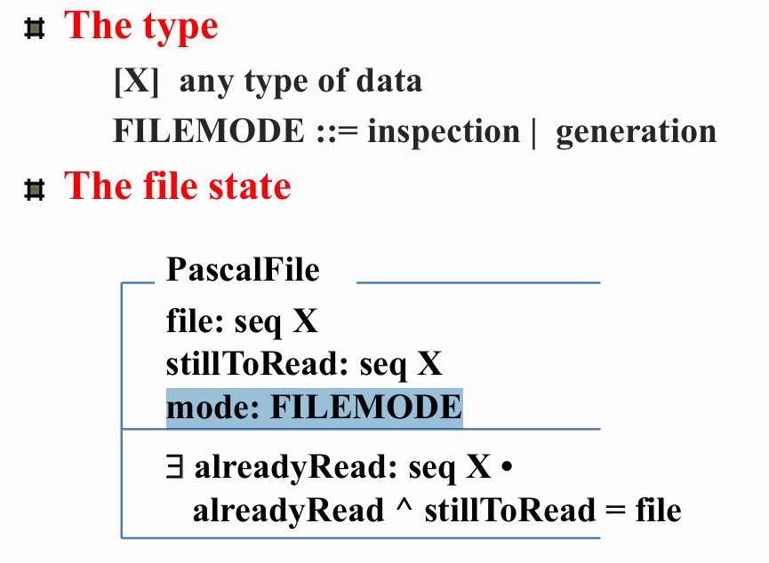

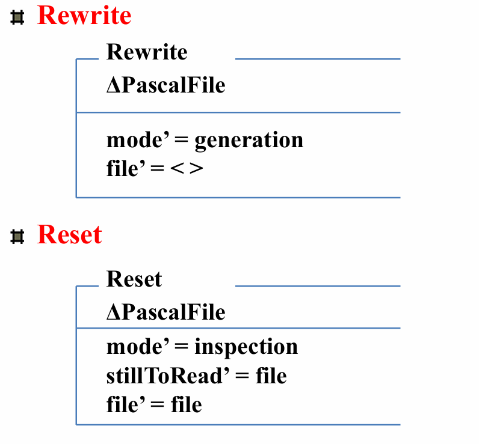

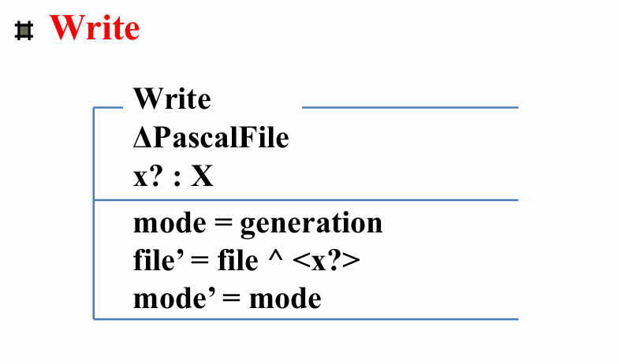

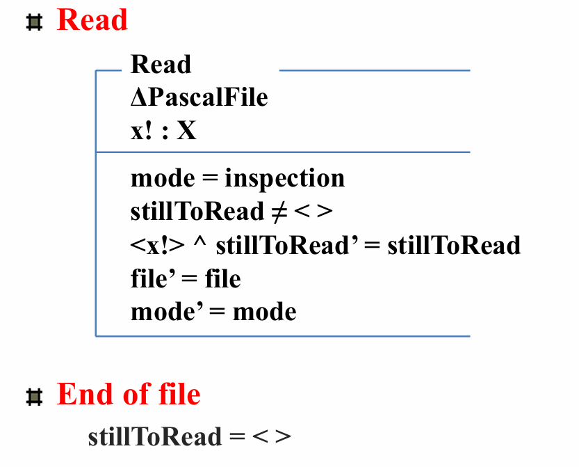

# * 举例：使用序列描述飞机系统

Example1: Using Sequences to Describe a System (Aircraft)

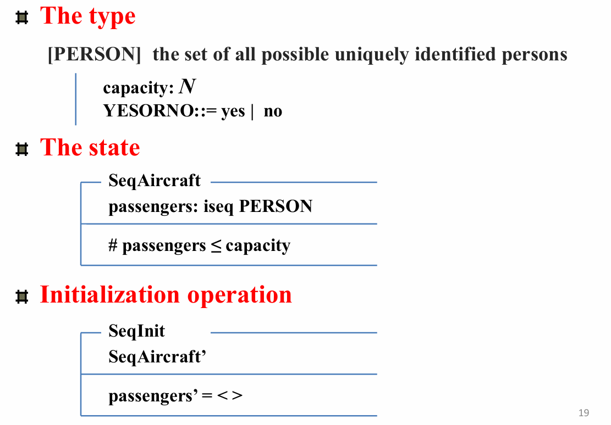

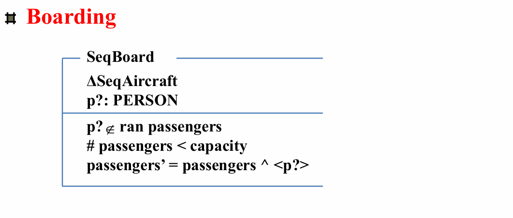

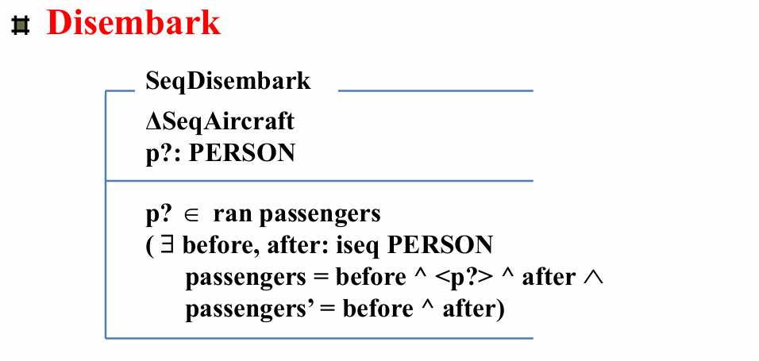

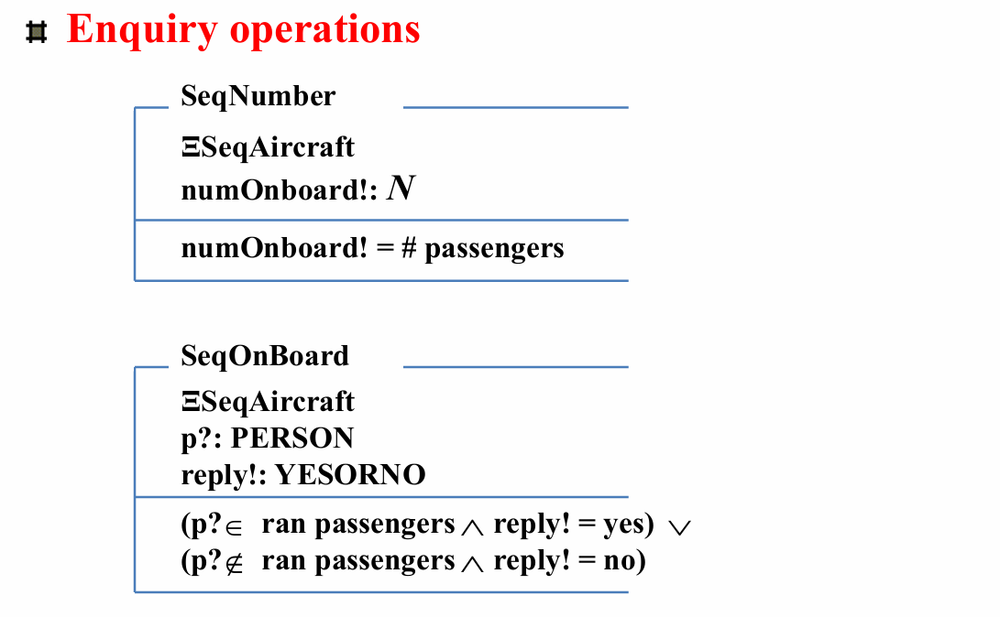

# * 举例：扩展飞机座位分配系统

Example2 : Extending Specification of Aircraft Seat Allocation System

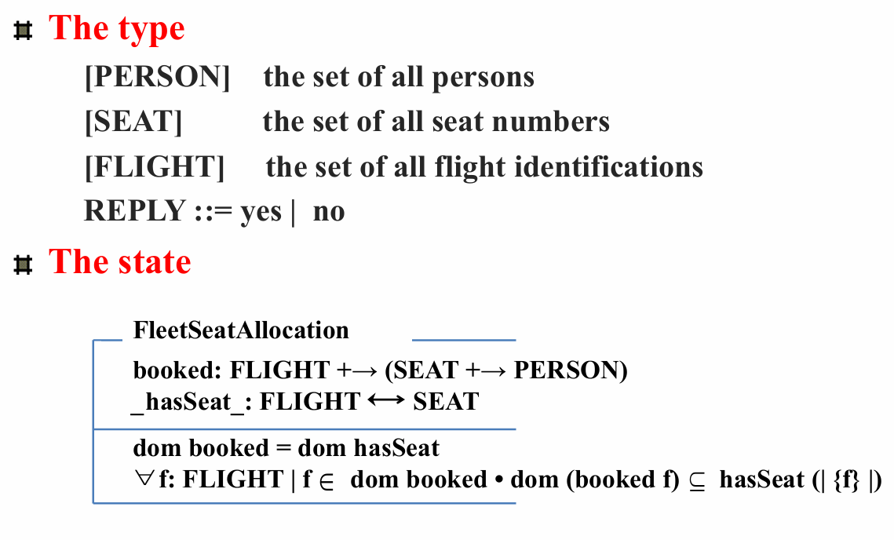

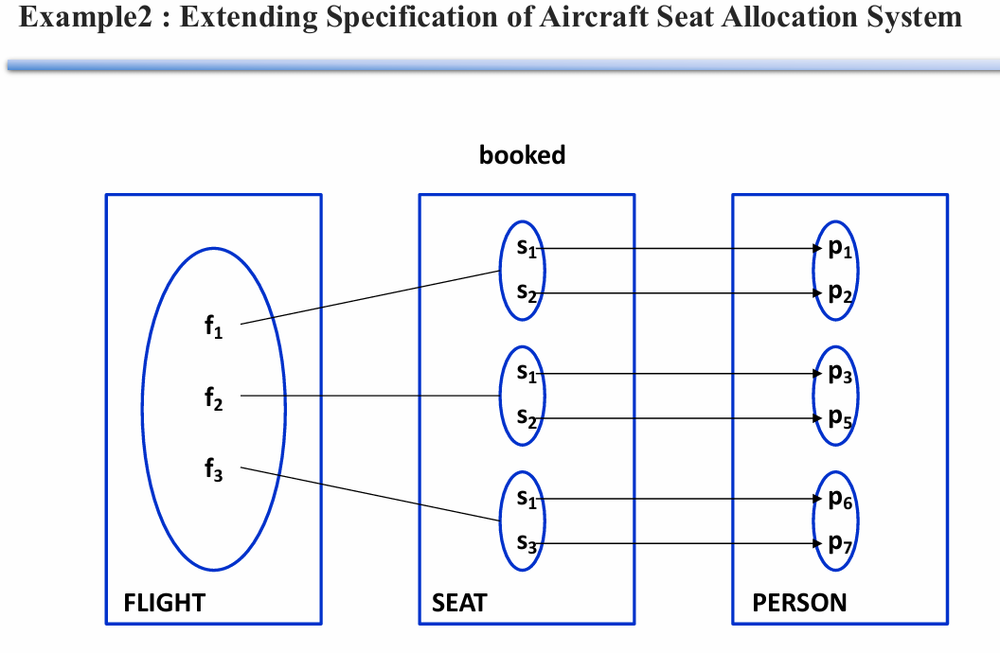
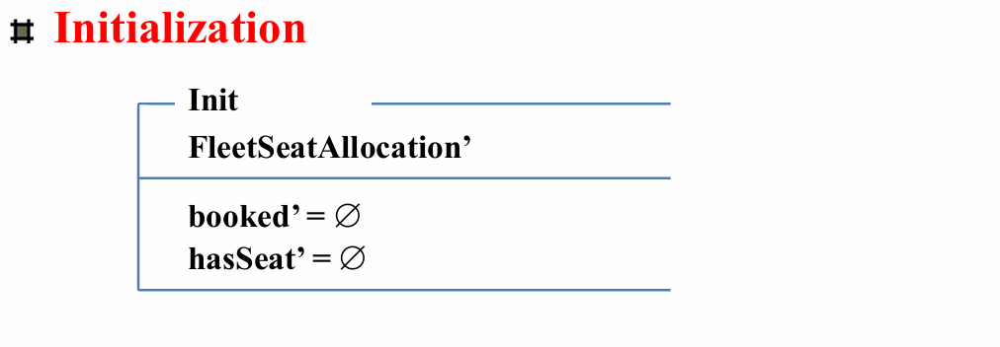

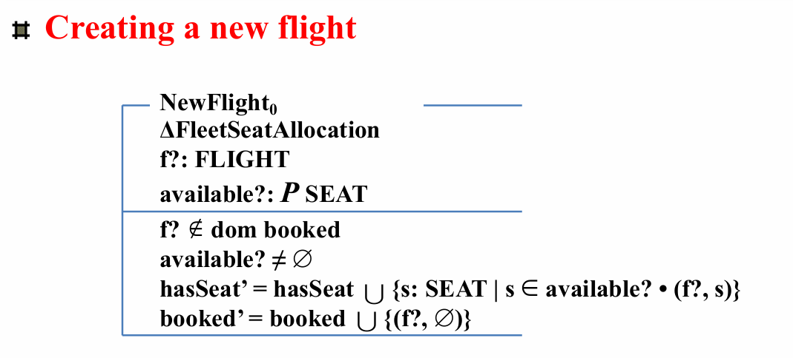

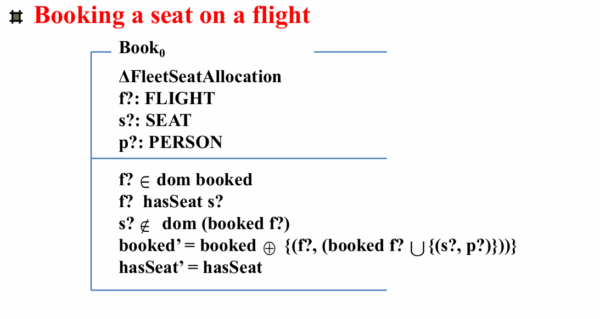

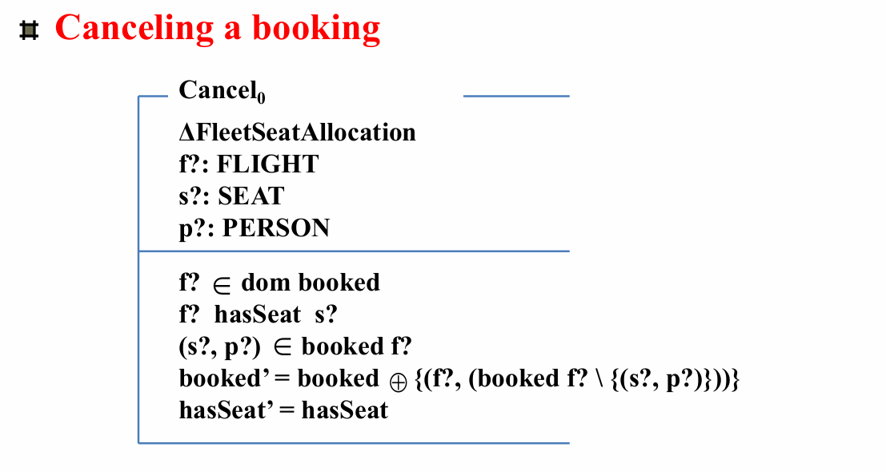

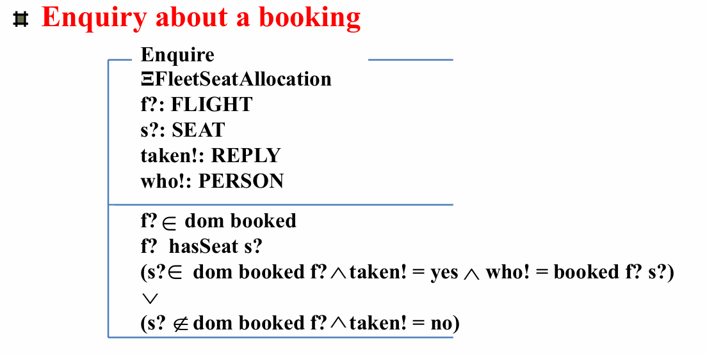