# Bags in Z

## 定义和表示

 ### Declaring a bag

全部由元素类型X组成的包声明为：

$bag X == X +→ N$

其中 N 表示所有自然数的集合。

### 包的必要性：

- 集合不能表示出现多次的元素
- 包虽然能表示，但有顺序
- 需要记录元素出现的次数而不需要顺序，这就是包（bag，multiset）

### 表示法（[[·]]-representation）：

- 写法：[[$a_1, a_2, ..., a_n$]]
- 空包：[[]]，n = 0
- 元素类型必须相同，顺序无所谓
- 举例：[[Alice, Bob, Jone, Bob]] = [[Alice, Bob, Bob, Jone]] ≠ [[Alice, Bob, Jone]]
- 此表示法不能表示无穷元素的包

### 函数表示法：

- 元素到正自然数的函数
- 写法：$\{Alice\mapsto1, Bob\mapsto2, Mike\mapsto3\}$（0 的可省）

### 集合到包：

- bag X == X +→ $N_1$
- bag X 中的每一个函数称为一个在 X 上的包
- 写法：b : bag X
- 举例：studyRecord : bag Student

## 包操作

### Count

> 包计数 count

- 语法：count 包名 元素名 = 元素出现的次数
- 举例：L = [[Alice, Alice, Jone, Bob, Bob, Bob]] $\{Alice\mapsto2, Jone\mapsto1, Bob\mapsto3\}$ count L Alice = 2, count L Bob = 3, count L Jone = 1, count L Mike = 0
- （取值不是直接取，而是直接把值和源组合起来判断有没有） 

### Bag membership and sub-bag relations

> 包成员 membership、子包 sub-bag 关系

定义：

- B : bag X
- c $\in$ X（c $\in$ dom B）
- 则 c 是 B 的成员（member），记作 c in B。

举例：

- L = [[Alice, Alice, Jone, Bob, Bob, Bob]]
- T = [[Alice, Alice, Alice, Jone, Bob, Bob, Bob, Mike]]
- 则 Alice in L，Bob in L，$\neg$(Mike in L)，Mike in T
- L $\sqsubseteq$ T，T $\not\sqsubseteq$ L (和集合的包含关系描述方法差不多，但是要注意这里的属于和包含于符号都是方的，集合中都是圆的)

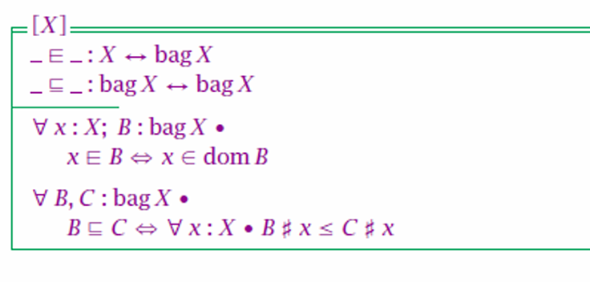

包成员和子包关系的性质
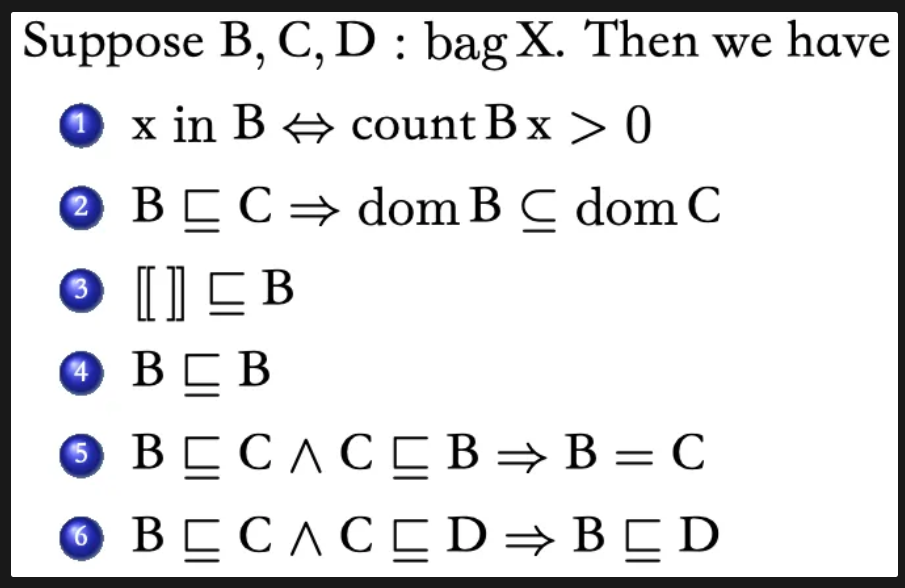

### Bags union and difference

> 包和差

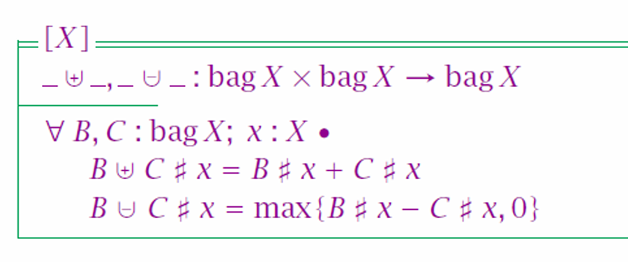

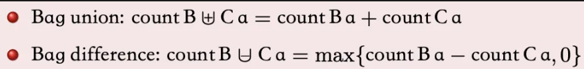

即对应值相加减，减法最小为 0。

包和差的性质

### Items 

如果 s 是一个序列，那么我们可以使用函数 items 从 s 中提取多重性信息，这将序列变成 bags：

$items\langle a, a, b, b, b, c\rangle = \{a\mapsto2, b\mapsto3, c\mapsto1\}$

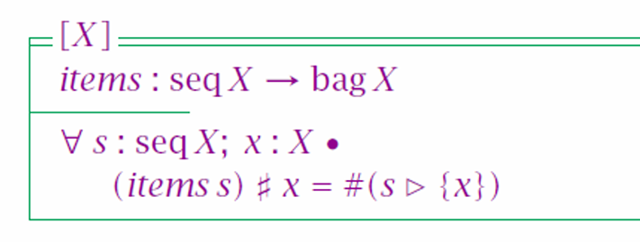

items 函数的性质

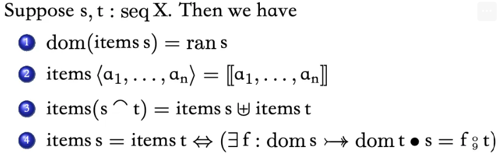

# * 举例：自动贩卖机

 Class-work:Vending Machine

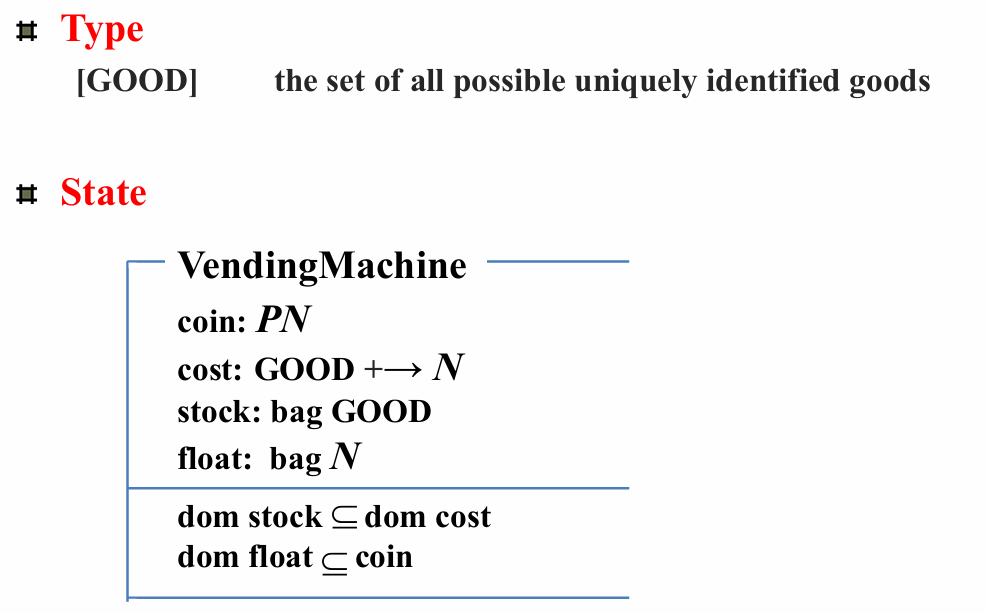

类型

状态模式：

- 价格：商品到自然数的函数
- 库存：商品的包

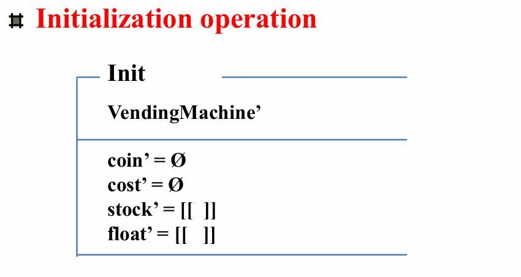

初始化
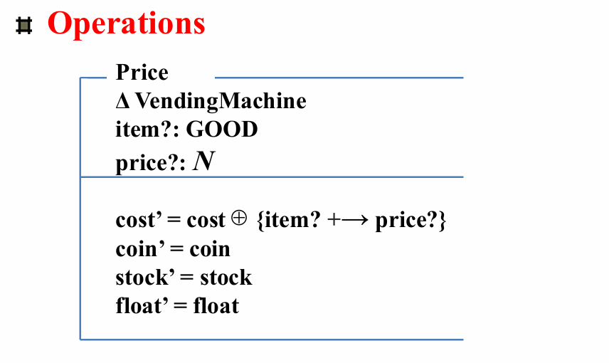

设置价格：

- 输入：商品、价格

成功

设置价格 == 设置价格 且 成功

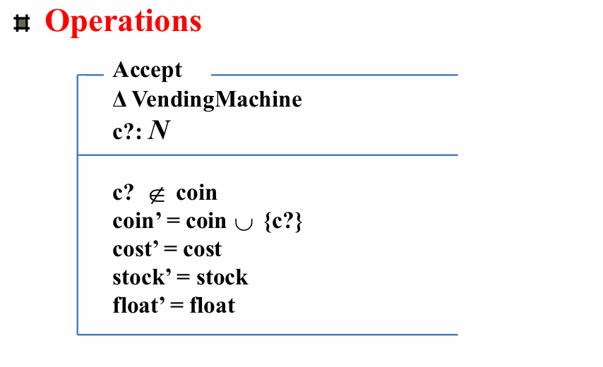

接受：

- 输入：coin

接受 == (接受 且 成功) 或 已经接受

`c? ∉ coin` 这个条件检查的意思是“输入的硬币 `c?` 不在当前已接受的硬币集合 `coin` 中”。这个条件的目的是为了确保自动售货机只接受新的硬币，即那些尚未被计入当前交易的硬币。

在实际的自动售货机设计中，可能会有机制防止用户插入无效或重复的硬币。这个条件检查可以模拟这种机制，确保只有有效的新硬币被接受。

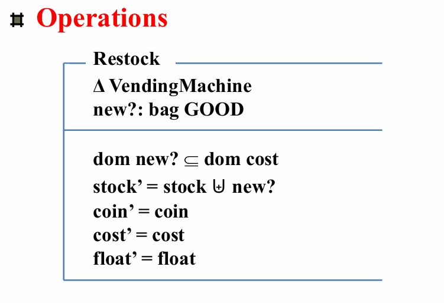

添加库存：

- 输入：商品的包

未设置价格：

- 输入：商品的包
- 输出：回复
- 商品不在价格函数里

添加库存 == (添加库存 且 成功) 或 未设置价格

sum 求和（递归）：

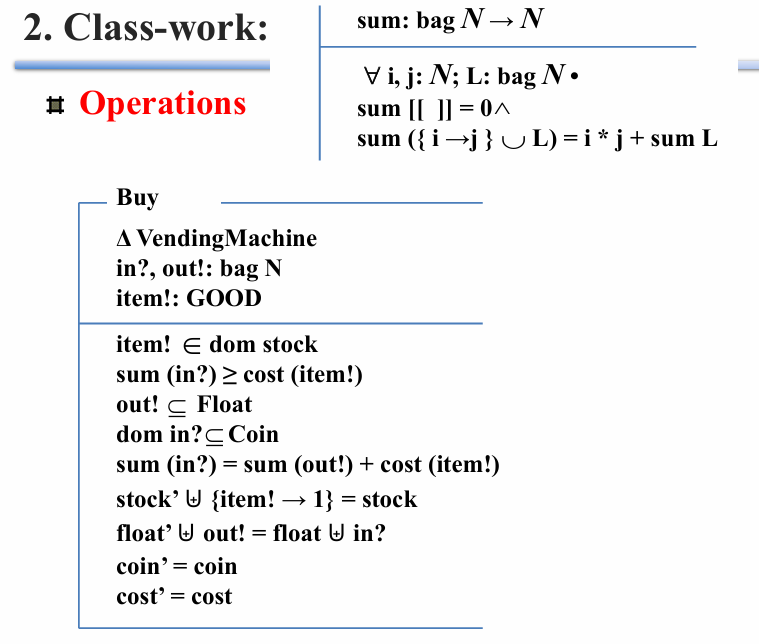

买：

- 输入：商品、自然数包（钱）
- 输出：自然数包（钱）
- 约束：输入的商品属于库存的 dom、给的钱足够、找零、给的钱是 coin 子集
- 操作：给的钱 = 找零 + 商品价格、库存 + 1 = 原库存、总钱 + 找零 = 前总钱 + 给的钱

不在库存

钱不够

不能找零：

- 不存在满足条件的找零

不能接受的钱币

买 == (买 且 成功) 或 不在库存 或 钱不够 或 不能找零 或 不能接受的钱币

取钱（或不成功）

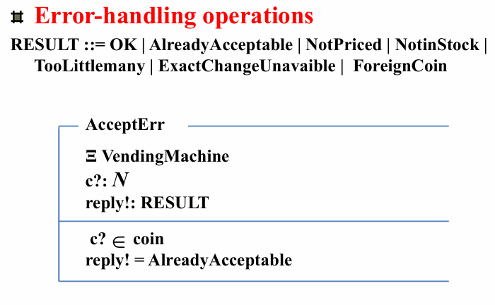

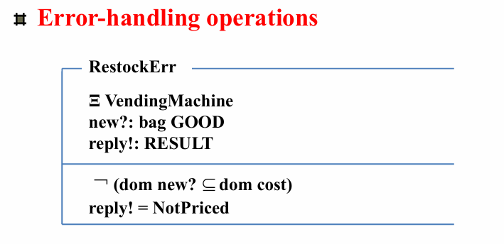

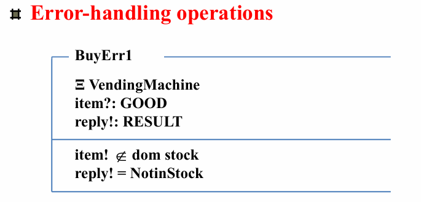

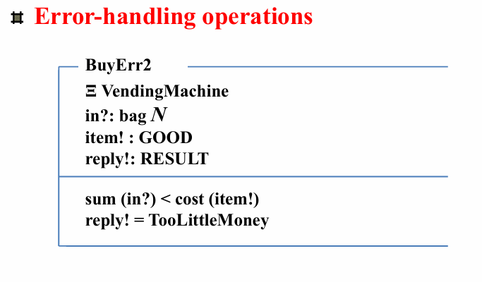

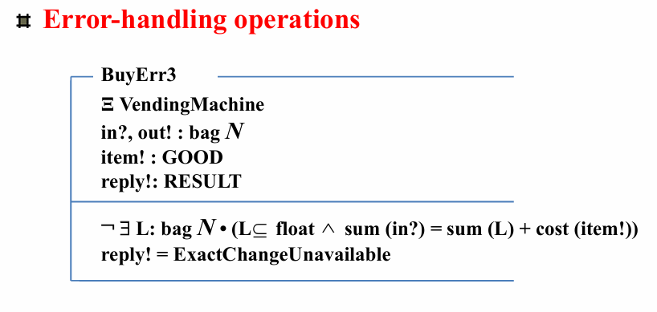

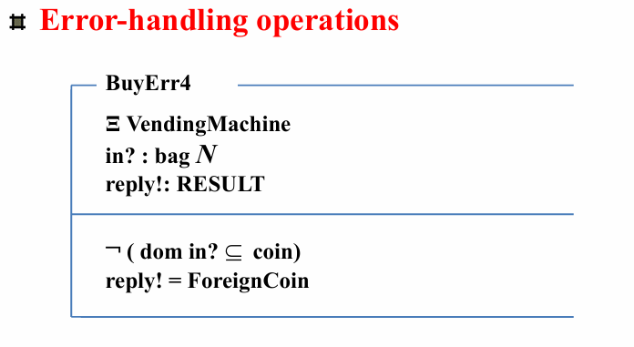

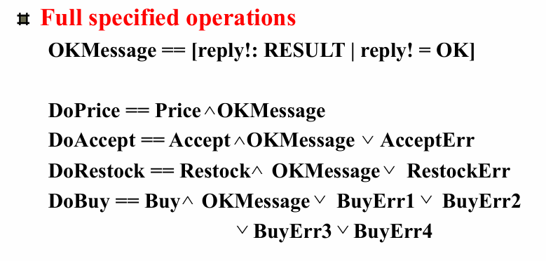