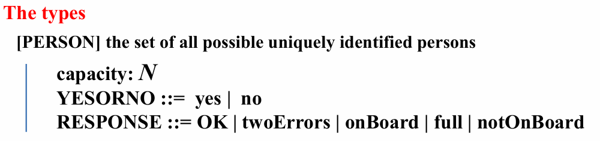
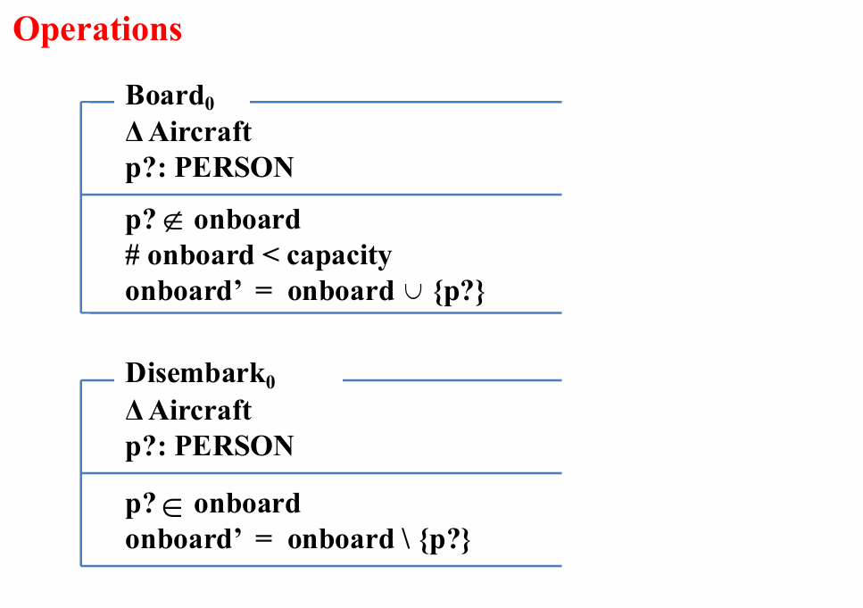
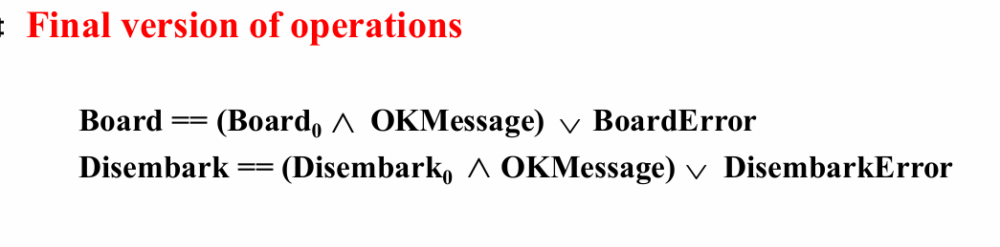

# Hints on creating specification

> 有关创建规范的提示

### Introduction

schema的说明

### * Type  

规范中使用的类型

Be sure that your types are truly atomic. 

>  确保你的类型是真正的原子类型

### Relationships 

By discovering how many values of what type are related to  how many of the other type, find out is any of the relations  are functions. 

> 通过发现什么类型的多少个值与多少个其他类型的值相关，找出任何关系都是函数。

### * The state  

状态及其不变属性

To discover some invariants, which are  included in the state  schema. 

> 发现一些不变量，这些不变量包含在状态架构中

### * Initialization

将变量设置为某个初始状态的操作

 operation The initial state should NOT violate any invariant of the  system.

> 初始状态不应违反系统的任何不变量。

* 在init声明中使用$State'$

 ### * Operations  

要求实现的各种操作

 To consider the behavior of each operation when it is given  sensible values. 

To state what does not change as a result of an operation. 

> 考虑每个操作在给定合理值时的行为。说明作不会因操作而改变的内容

* 在Operations声明中使用$\Delta State$

### * Enquiry operations 

查询

Use a xi ($\Xi$) schema where possible. 

* 在enquiry和error声明中使用$\Xi State$

### In the case of severe difficulty 

To try viewing it in a more abstract way.  

To hide some of the details at first.

> 尝试以更抽象的方式查看它。首先隐藏一些细节。

### Error

错误处理

* 在enquiry和error声明中使用$\Xi State$

### Final version

操作和查询的最终版本

每个error后都会写一个Final version，形式为：

`操作 == ( 初始情况 $\wedge$ OKMessage) $\vee$ 错误情况`

（其中OKMessage在error前定义，其type为RESPONSE，表示正常情况， reply 为 OK；对于错误情况，输出开头定义的RESPONSE错误类型。）

OKMessage定义为：

`OKMessage == [rep! : RESPONSE | rep! = OK]`

# *举例：Aircraft系统

* types

  类型：

  - 集合 [PERSON]
  - 变量（基本、自由）

* state 

  状态：

  - 声明系统的变量（取子集）
  - 约束

* Initialization

  初始化：

  - 到下一状态
  - 空集

* operations

  操作：

  - 每一种操作对应系统的状态改变 $\Delta$（系统变量改变）
  - 声明输入 ? 变量
  - 变量约束、次态变量操作

* Enquiry operations

  查询：

  - 每一种查询对应系统的状态改变 $\Xi$（系统变量不变）
  - 声明输入 ? 输出 ! 变量
  - 对应输入变量，赋值给输出变量
  - 不同情况用 $\vee$ 连接，同一情况用 $\wedge$ 连接

* Dealing with errors

  错误处理：

  - 发生错误时对应系统的状态改变 $\Xi$（系统变量不变）
  - 声明输入 ? 输出 ! 变量
  - 根据特定输入，列出各种可能出错的情况，对应输出

* Final version of operations

  最终：

  - 对于正常情况，定义 OKMessage，其 reply 为 OK
  - 操作 == (初始情况 $\wedge$ OKMessage) $\vee$ 错误情况

# * 举例：EXAMPLE_Lib

见ppt。