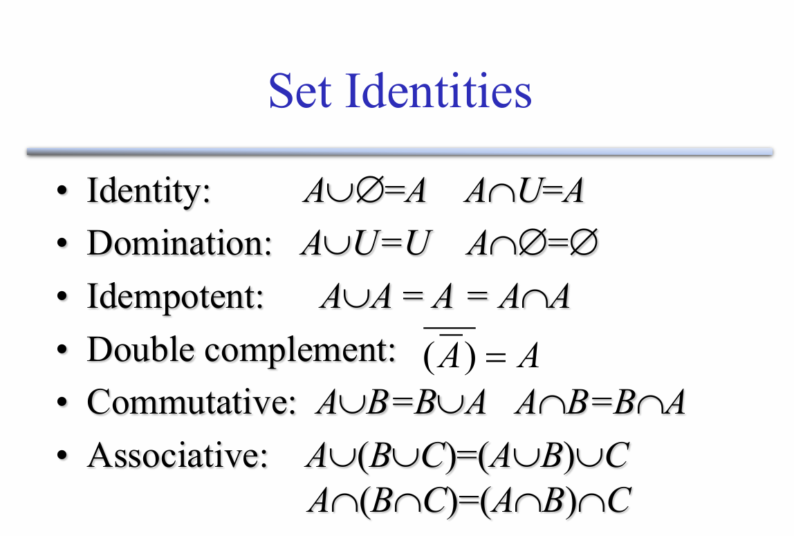
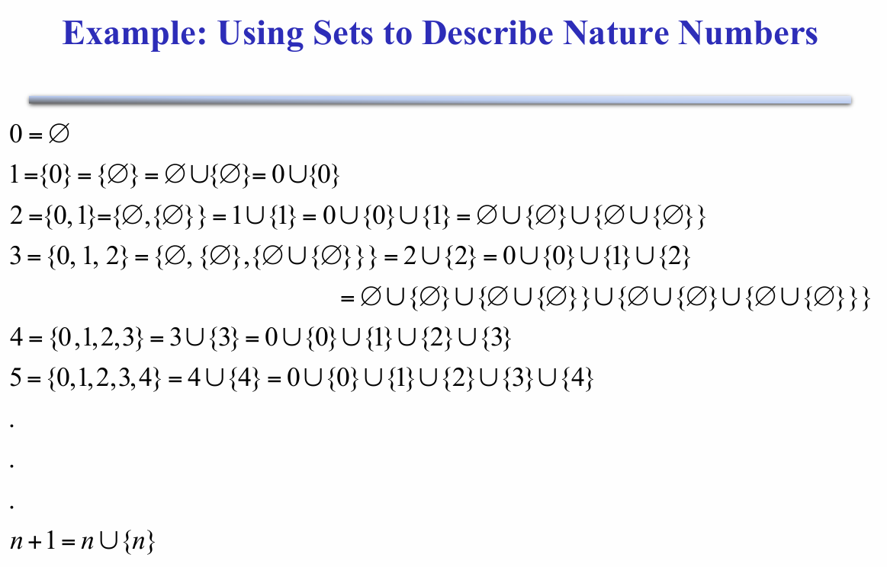

# Set Theory

## set

### 定义：

集合是一个结构，表示零个或多个不同（不同）对象的集合无序集合（组、复数）

>A  is a structure, representing an  set unordered collection (group, plurality) of  zero or more  distinct (different) objects.

### Basic notations for sets：

> 集合的基本符号

For sets, we’ll use variables   S ,  T ,  U, … 来代表集合变量

或者用列举法或描述法表示集合，和中学学过的一样。

### Infinite Sets

> 无限集I

mbols for some special infinite sets:

N= {0, 1, 2, …}    The  natural numbers.

Z= { …,  2, - 1, 0, 1, 2, …}  The  integers.

R= The real numbers.  such as 374.1828471929498181917281943125…

### The Empty Set 

> 空集

$\varnothing = \{\} = \{x|False\}$

$\neg\exist x: x \in\varnothing$

### Set Equality

>集合相等

Two sets are declared to be equal  they contain  exactly the same if and only if elements.

### Venn Diagrams

### Proper (Strict) Subsets & Supersets

> 真Proper (Strict)子集和超集

* 真子集$\subset$,(子集$\subseteq$)

如果集合A的所有元素都是集合B的元素，且集合A不等于集合B，那么我们称集合A是集合B的真子集，记作 *A*⊂*B*。

* 真超集（严格超集）

如果集合B的所有元素都是集合A的元素，且集合B不等于集合A，那么我们称集合A是集合B的真超集，记作 *A*⊃*B*。

### Sets Are Objects, Too!

作为集合元素的对象本身可以是集合

### Cardinality and Finiteness

 | S | (read “the  cardinality of S ”) is a measure of how many different elements S has.

 E.g.  | $\varnothing $ |=0,    |{1,2,3}| = 3

## 集合运算

- Union（并）
- Intersection（交）
- Disjointedness（不相交）  A Union B= $\varnothing $ 
- Difference（差）
- Complements（补）
- Symmetric difference，$A\triangle B$（对称差）

## Set Identities

- Identity：并空集、交补集不变
- Domination：并补集为补集、交空集为空集
- Idempotent：并自身、交自身不变
- Double complement：补集的补集是自身
- Commutative：交换律
- Associative：结合律

## The Power Set Operation

> 幂集（Power Set）

子集的集合。

$P(S) = \{x|x\subseteq S\} = 2^S$

对于有穷集合：$|P(S)| = 2^{|S|}$

$|P(N)| > |N|$

Eg.    P({a, b}) = { {$\varnothing$}, {a}, {b}, {a,b}}

## Cartesian Products of Sets

> 笛卡尔积（Cartesian Products）

$A\times B :\equiv \{(a, b) | a \in A \wedge b \in B\}$

对于有穷集合：$|A\times B| = |A||B|$

不可交换：$\neg\forall AB: A\times B = B\times A$

## Binary Relations

> 二元关系

二元关系是笛卡尔积的子集。

$R: A\leftrightarrow B$（是 $A\times B$ 的子集）

$<: N\leftrightarrow N :\equiv \{(n, m) | n < m\}$

$aRb$ 即 $(a, b) \in R$

## Other relation

### Universal relation

> 全关系

* 定义

假设有一个集合 *A*，集合 *A* 上的全关系 *R* 是指集合 *A* 中的任意两个元素 *a* 和 *b*（*a*,*b*∈*A*），都满足关系 *R*。换句话说，对于集合 *A* 中的所有元素对 (*a*,*b*)，关系 *R* 都成立。

* 举例

假设集合 *A*={1,2,3}，定义一个关系 *R* 为“小于等于”（≤），即对于集合 *A* 中的任意两个元素 *a* 和 *b*，如果 *a*≤*b*，则 (*a*,*b*)∈*R*。

那么，关系 *R* 可以表示为： *R*={(1,1),(1,2),(1,3),(2,2),(2,3),(3,3)}

在这个例子中，集合 *A* 中的任意两个元素都满足关系 *R*，因此 *R* 是集合 *A* 上的一个全关系。

### Empty relation

> 空关系

假设有一个集合 *A*，集合 *A* 上的空关系 *R* 是指集合 *A* 中没有任何两个元素 *a* 和 *b*（包括元素自身）满足关系 *R*。换句话说，关系 *R* 是一个空集，记作 *R*=∅。

### Identity relation

> 恒等关系

* 定义

假设有一个集合 *A*，集合 *A* 上的恒等关系 *I**A* 是指集合 *A* 中的每个元素 *a* 都与自身满足关系 *I**A*，但不与其他元素满足关系 *I**A*。换句话说，恒等关系 *I**A* 是集合 *A* 上的一个关系，其中只包含形如 (*a*,*a*) 的元素对，即 *I**A*={(*a*,*a*)∣*a*∈*A*}。

* 举例

假设集合 *A*={1,2,3}，定义集合 *A* 上的恒等关系 *I*。

那么，恒等关系 *I* 可以表示为： *I*={(1,1),(2,2),(3,3)}

在这个例子中，集合 *A* 中的每个元素都与自身满足关系 *I*，但不与其他元素满足关系 *I*。

### Inverse relation

> 逆关系

* 定义

逆关系是指将一个关系中的每个有序对的元素顺序互换后得到的新关系。具体来说，设 *R* 是集合 *A* 到集合 *B* 的一个关系，即 *R*⊆*A*×*B*，那么 *R* 的逆关系 *R*−1 是从集合 *B* 到集合 *A* 的关系，定义为： *R*−1={(*y*,*x*)∣(*x*,*y*)∈*R*} 这意味着，如果 (*x*,*y*) 是关系 *R* 中的一个元素，那么 (*y*,*x*) 就是逆关系 *R*−1 中的一个元素。

* 举例

假设集合 *A*={1,2,3}，集合 *B*={4,5,6}，关系 *R*={(1,4),(2,5),(3,6)}。

那么，逆关系 *R*−1={(4,1),(5,2),(6,3)} 。

### n-ary relation

> n元关系

* 定义

n-ary 关系（n元关系）是集合论和关系理论中的一个基本概念，它描述了涉及 n 个集合的元素之间的某种关系。具体来说，设 *A*1,*A*2,…,*A* *n* 是 n 个集合，那么从这些集合中各取一个元素形成的有序 n 元组的集合就构成了一个 n-ary 关系。形式上，n-ary 关系 *R* 是笛卡尔积 *A*1×*A*2×⋯×*A* *n* 的一个子集，即： *R*⊆*A*1×*A*2×⋯×*A* *n*

* 举例

1. **二元关系**：
   - 假设集合 *A*={1,2} 和集合 *B*={3,4}，关系 *R*={(1,3),(2,4)} 是一个二元关系，表示 *A* 中的元素与 *B* 中的元素之间的某种关系。
2. **三元关系**：
   - 假设集合 *A*={1,2}，集合 *B*={3,4}，集合 *C*={5,6}，关系 *R*={(1,3,5),(2,4,6)} 是一个三元关系，表示 *A*、*B* 和 *C* 中的元素之间的某种关系。

## Reflexivity

> 自反性

R 在 A 上自反，当 $\forall a \in A$, $aRa$。

## Symmetry & Antisymmetry

> 对称性（Symmetry）和反对称性（Antisymmetry）

* 对称（Symmetry）

对称关系是指集合中元素之间的关系满足以下条件：如果元素 *a* 与元素 *b* 之间存在关系 *R*，那么元素 *b* 与元素 *a* 之间也存在关系 *R*。形式上，对于集合 *A* 上的关系 *R*，如果对于所有 *a*,*b*∈*A*，都有： (*a*,*b*)∈*R*⟹(*b*,*a*)∈*R* 则称 *R* 是对称的。

* 反之反对称

## Transitivity

> 传递性

## Equivalence Relation

> 等价关系

满足自反、对称、传递。

## Order Relation

> 序关系

满足自反、反对称、传递。

## Definition of Functions

$f:A \rightarrow B$

# * Example

* 定义自然数与集合的关系：

  $n=\{0,1,2...n-1\}$

* 推导各个自然数与集合的关系

* 求出通式：$n+1=n\cup\{n\}$

