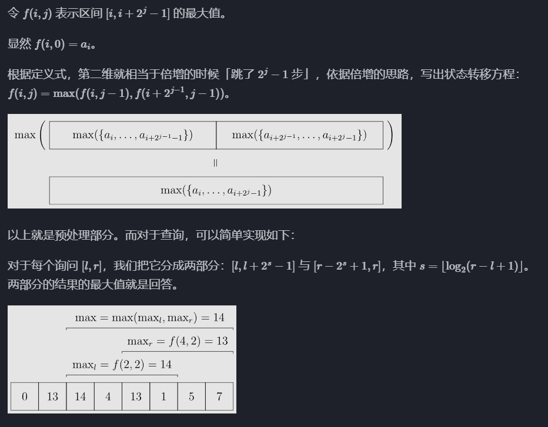

# 算法精选

此篇为在做题过程中的获得的感悟以及比较常用的知识 ~

长期持续更新中......

#### auto用法

##### 1.遍历

与范围for循环结合使用

* 遍历`vector`

```cpp
#include <iostream>
#include <vector>
 
int main() {
    vector<int> vec = {1, 2, 3, 4, 5};
 
    // 使用 auto 关键字和范围for循环
    for (auto& elem : vec) {
        cout << elem << endl; // 自动推导 elem 的类型为 int&
    }
 
    return 0;
}
```

* 遍历`map`

```cpp
#include <iostream>
#include <map>
 
int main() {
    map<string, int> myMap = {{"apple", 1}, {"orange", 2}, {"pear", 3}};
 
    // 使用 auto 关键字和范围for循环
    for (auto& pair : myMap) {
        cout << pair.first << ": " << pair.second << endl; // 自动推导 pair 的类型为 pair<const string, int>&
    }
 
    return 0;
}
```

* 遍历`array`

```cpp
#include <iostream>
#include <array>
 
int main() {
    array<int, 5> arr = {1, 2, 3, 4, 5};
 
    // 使用 auto 关键字和范围for循环
    for (auto& elem : arr) {
        cout << elem << endl; // 自动推导 elem 的类型为 int&
    }
 
    return 0;
}
```

##### **2.自动推导变量类型**

```cpp
auto max_it = max_element(h.begin(),h.end());
//auto自动推导变量类型
```

#### 浮点数取整和精度

##### 取整

**`floor函数`**

把一个小数向下取整`floor(doube x)`

```cpp
    double i = floor(2.2);
    double j = floor(-2.2);
    cout << "The floor of 2.2 is " << i << endl; //2
    cout << "The floor of -2.2 is " << j << endl; //-3
```

**`ceil函数`**

把一个小数向上取整`ceil(doube x)`

```cpp
    double i = ceil(2.2);
    double j = ceil(-2.2);
    cout << "The ceil of 2.2 is " << i << endl; //3
    cout << "The ceil of -2.2 is " << j << endl; //-2
```

**`round函数`**

把一个小数四舍五入`round(doube x)`

```cpp
   double i = round(2.2);
    double x = round(2.7);
    double j = round(-2.2);
    double y = round(-2.7);
    cout << "The round of 2.2 is " << i << endl; //2
    cout << "The round of 2.7 is " << x << endl; //3
    cout << "The round of -2.2 is " << j << endl; //-2
    cout << "The round of -2.7 is " << y << endl; //-3
```

##### 精度

在输出过程中控制精度：

```cpp
    cout << fixed << setprecision(n) << val << endl;
//其中 n>=0 ，表示保留n位有效数字
```

与取整结合：

```cpp
    cout << fixed << setprecision(0) << round(val) << endl;
```


#### 重载运算符

重载运算符分为两种情况，重载为成员函数或非成员函数。

* 当重载为成员函数时，因为隐含一个指向当前成员的 `this` 指针作为参数，此时函数的参数个数与运算操作数相比少一个。

* 而当重载为非成员函数时，函数的参数个数与运算操作数相同。

其基本格式为（假设需要被重载的运算符为 `@`）：

```cpp
class Example {
  // 成员函数的例子
  返回值 operator@(除本身外的参数) { /* ... */ }
};

// 非成员函数的例子
返回值 operator@(所有参与运算的参数) { /* ... */ }
```

例：

```cpp
struct Edge{ //边的结构体
    int u,v,w; //u 和 v 为边的两个端点，w 为权重
    bool operator < (const Edge& e) const {
        return w >e.w; //// 用于按边的权重降序排序
    }
}
```


#### 关于方向数组

在解题过程中我们常会运用网格（grid），来模拟二维平面，控制移动则需要方向数组。

以二维平面上的上下左右四个方向为例：

```cpp
int dir[4][2] = {{0,1},{1,0},{-1,0},{0,-1}}
```

- `dir` 是一个二维数组，有 4 行（表示 4 个方向）和 2 列（分别表示 x 轴和 y 轴的偏移量）。
- 通常第一个坐标代表列 第二个坐标代表行
- 每个方向用一个二维数组表示，例如：
  - `{0, 1}` 表示向右移动。
  - `{1, 0}` 表示向下移动。
  - `{-1, 0}` 表示向上移动。
  - `{0, -1}` 表示向左移动。

在方向数组中：

- `dir[i][0]` 表示第 `i` 个方向在 **x 轴上的偏移量**。
- `dir[i][1]` 表示第 `i` 个方向在 **y 轴上的偏移量**。

即方向数组`dir[i][j]`中第一个索引为方向，第二个索引为维度，数组内部方向的交换并不影响偏移量的对应。

#### 再议vector

vector的二维初始化：

行列长度均固定 `n `行 `m `列，初始值为0如下

```cpp
vector<vector<int>> a(n, vector<int>(m, 0));
```

则`a.size()`表示行数 `a[0].size()`表示列数

## 数组

### 二分查找

模板：

```cpp
int l,r,min;
    l = 0;
    r = numsSize -1;
	while(r>l){
        min = l + (l + r)/2;
        if(nums[min] > target){
            r = min - 1;
        }
        else if(nums[min] < target){
            l = min + 1;
        }
        else{
            return min;
        }  
        return -1;
    }
```


> 给定一个排序数组和一个目标值，在数组中找到目标值，并返回其索引。如果目标值不存在于数组中，返回它将会被按顺序插入的位置。
>
> 请必须使用时间复杂度为 `O(log n)` 的算法。

```cpp
    int searchInsert(vector<int>& nums, int target) {
    int l,r,m;
    l = 0;
    r = numsSize -1;
    if(target <= nums[0]){
        return 0;
    }
    if(target >= nums[numsSize - 1]){
        return numsSize;;
    }
    else{
        while(r>l){
        m = l + (l + r)/2;
        if(nums[m] > target){
            r = m - 1;
        }
        else if(nums[m] < target){
            l = m + 1;
        }
        else{
            return m;
        }  
    }
    return l + 1;
    }
    }
```

## ST表

ST 表（Sparse Table，稀疏表）是用于解决 **可重复贡献问题** 的数据结构。

具体实现如下：



## 回溯

回溯三部曲：

- **确定递归函数参数**
- **确定终止条件**
- **单层搜索过程**

模板：

```cpp
void backtracking(参数) {
    if (终止条件) {
        存放结果;
        return;
    }

    for (选择：本层集合中元素（树中节点孩子的数量就是集合的大小）) { //横向遍历
        处理节点;
        backtracking(路径，选择列表); // 递归 纵向遍历
        回溯，撤销处理结果
    }
}
```

## DP

### 背包

#### 0-1背包

* 二维

  i 来表示物品、j表示背包容量，初始化：

  ```cpp
  // 初始化 dp
  vector<vector<int>> dp(weight.size(), vector<int>(bagweight + 1, 0));
  for (int j = weight[0]; j <= bagweight; j++) {
      dp[0][j] = value[0];
  }
  ```

  先遍历物品，然后遍历背包重量：

  ```cpp
  // weight数组的大小 就是物品个数
  for(int i = 1; i < weight.size(); i++) { // 遍历物品
      for(int j = 0; j <= bagweight; j++) { // 遍历背包容量
          if (j < weight[i]) {
              dp[i][j] = dp[i - 1][j];
          }
          else {
              dp[i][j] = max(dp[i - 1][j], dp[i - 1][j - weight[i]] + value[i]);
          }
      }
  }
  
  return dp[n - 1][bagweight];
  ```

  状态转移方程 `dp[i][j] = max(dp[i - 1][j], dp[i - 1][j - weight[i]] + value[i]);`

* 一维

  初始化：

  ```cpp
  vector<int> dp(bagweight + 1, 0);
  ```

  遍历：

  ```cpp
   // 外层循环遍历物品
      for (int i = 0; i < M; ++i) {
          // 内层循环从 N 空间逐渐减少遍历背包容量
          for (int j = N; j >= costs[i]; --j) {
              // 考虑当前研究材料选择和不选择的情况，选择最大值
              dp[j] = max(dp[j], dp[j - costs[i]] + values[i]);
          }
      }
  
  return dp[N];
  ```

  状态转移方程 `dp[j] = max(dp[j], dp[j - weight[i]] + value[i]);`


## 图论

### 存图方法：

* **邻接表存图方法：✅（适用于稀疏图）**

例如

```lua
  1 -- 2
  |  /
  | /
  3 -- 4
```

邻接表存储：

```cpp
vector<int> a[N];  // 存储图的邻接表
```

```cpp
a[1] = {2, 3};
a[2] = {1, 3};
a[3] = {1, 2, 4};
a[4] = {3};
```

代码：

```cpp
#include <iostream>
#include <vector>
using namespace std;

const int N = 1000;  // 最大点数
vector<int> adj[N];  // 邻接表

int main() {
    int n, m;  // n个节点，m条边
    cin >> n >> m;
    for (int i = 0; i < m; i++) {
        int u, v;
        cin >> u >> v;
        adj[u].push_back(v);
        adj[v].push_back(u); // 无向图需要双向存储
    }
    return 0;
}
```

* **邻接矩阵存图方法：✅（适用于稠密图）**

代码：

```cpp
#include <iostream>
using namespace std;

const int N = 1000;
int graph[N][N];  // 直接存邻接矩阵

int main() {
    int n, m;
    cin >> n >> m;
    for (int i = 0; i < m; i++) {
        int u, v;
        cin >> u >> v;
        graph[u][v] = 1;
        graph[v][u] = 1;  // 无向图需要双向存储
    }
    return 0;
}
```

**拓展：加权图**

```cpp
graph[u][v] = w;  // 存储权重 w
```


- **树（稀疏图）一般用** **邻接表**。
- **稠密加权图（如 Floyd-Warshall）一般用** **邻接矩阵**。
- **最小生成树（MST）一般用** **边列表**。
- **网络流、动态添加边一般用** **链式前向星**。

### dfs

模板：

```cpp
int dir[4][2] = {{0,1},{1,0},{-1,0},{0,-1}};

void dfs(const vector<vector<int>>& grid, vector<vector<bool>>& visited, int x, int y){
    //
	if(visited[x][y] || grid[x][y] == 0) return;
	visited[x][y] = true;
	for(int i = 0;i<4; i++){
		int nextx = x + dir[i][0];
		int nexty = y + dir[i][1];
		if(nextx<0 || nexty<0 || nextx>=grid.size() || nexty>=grid[0].size()) continue;
        //grid.size()表示行数 grid[0].size()表示列数
		dfs(grid,visited,nextx,nexty);
        
        // 注意：一些题（包括此模板）是用dfs标记 不用回溯
        //而在一些寻找路径的题中用dfs需要回溯
        
	}
}
```


* 邻接表存图

```cpp
public:
    vector<vector<int>> ans;// 用于存储所有路径
    vector<int> stk;// 用于存储当前路径

    void dfs(vector<vector<int>>& graph, int x, int n) {
        //x 是当前节点
        //n 是目标节点的编号（graph.size() - 1）
        if (x == n) {
            ans.push_back(stk);
            return;
        }
        
        //**********************************************
        for (auto& i : graph[x]) {//遍历节点 x 的所有邻接节点并存在i中
            stk.push_back(i);// 将邻接节点加入当前路径
            dfs(graph, i, n);// 递归遍历邻接节点
            stk.pop_back();// 回溯：移除当前节点，恢复路径
        }
    }

	//************************************************************8

    vector<vector<int>> allPathsSourceTarget(vector<vector<int>>& graph) {//主函数：
        stk.push_back(0);// 将源点（节点 0）加入当前路径 stk
        dfs(graph, 0, graph.size() - 1);//从源点（节点 0）开始，目标节点为 graph.size() - 1
        return ans;//返回存储所有路径的二维向量
    }
};
```

* 邻接矩阵存图

```cpp
for (int i = 1; i <= n; i++) { // 遍历节点x链接的所有节点
    if (graph[x][i] == 1) { // 找到 x链接的节点
        path.push_back(i); // 遍历到的节点加入到路径中来
        dfs(graph, i, n); // 进入下一层递归
        path.pop_back(); // 回溯，撤销本节点
    }
}
```

### bfs

模板：

```cpp
int dir[4][2] = {0, 1, 1, 0, -1, 0, 0, -1}; // 表示四个方向
// grid 是地图，也就是一个二维数组
// visited标记访问过的节点，不要重复访问
// x,y 表示开始搜索节点的下标
void bfs(vector<vector<char>>& grid, vector<vector<bool>>& visited, int x, int y) {
    queue<pair<int, int>> que; // 定义队列
    que.push({x, y}); // 起始节点加入队列
    visited[x][y] = true; // 只要加入队列，立刻标记为访问过的节点
    while(!que.empty()) { // 开始遍历队列里的元素
        pair<int ,int> cur = que.front(); que.pop(); // 从队列取元素
        int curx = cur.first;
        int cury = cur.second; // 当前节点坐标
        for (int i = 0; i < 4; i++) { // 开始想当前节点的四个方向左右上下去遍历
            int nextx = curx + dir[i][0];
            int nexty = cury + dir[i][1]; // 获取周边四个方向的坐标
            if (nextx < 0 || nextx >= grid.size() || nexty < 0 || nexty >= grid[0].size()) continue;  // 坐标越界了，直接跳过
            if (!visited[nextx][nexty]) { // 如果节点没被访问过
                que.push({nextx, nexty});  // 队列添加该节点为下一轮要遍历的节点
                visited[nextx][nexty] = true; // 只要加入队列立刻标记，避免重复访问
            }
        }
    }

}
```

### Kruskal 算法

Kruskal 算法的核心思想是：

1. **排序**：首先对所有边按权值从小到大排序。
2. **选择边**：依次遍历排序后的边，对于每一条边，检查它的两个端点是否已经在同一棵树中（即它们是否已经连通）。如果没有连通，则将这条边加入生成树，并合并两个集合。
3. **避免环**：使用并查集来检测是否会形成环。如果两个端点已经在同一个集合中，就跳过这条边。

则要利用并查集：

- 并查集（Union-Find）是用于快速判断两个节点是否在同一集合中的数据结构。通过路径压缩和按秩合并等技术，能够保证每次查询和合并操作的时间复杂度非常低。
- 在 `kruskal` 中，`find(u)` 用来查找 `u` 的祖先节点，`p[pv] = pu;` 用来合并两个集合，这样就确保了不会添加重复的边，避免了环的产生。

例：

```cpp
struct Edge{ //边的结构体
    int u,v,w; //u 和 v 为边的两个端点，w 为权重
    bool operator < (const Edge& e) const {
        return w >e.w; //// 用于按边的权重降序排序
    }
}

Edge edge[M]; // 存储所有边的数组
vector<pair<int,int>> g[N]; // 邻接表存储图
int p[N+1];// 并查集，用于记录每个节点的父节点

void kruskal(){
    sort(edge,edge+m); // 将所有边按权重降序排序
    for(int i = 0; i < m; i++){
        auto[u,v,w] = edge[i];//解构了边的信息：u 和 v 是边的两个端点，w 是边的权值
        int pu = find(u), pv = find(v);// 查找 u 和 v 所在的祖先节点
        if(pu != pv){// 如果 u 和 v 不在同一棵树中
            p[pv] = pu;// 合并 u 和 v 所在的集合
            g[u].push_back({v,w});//无向图
            g[v].push_back({u,w});
        }
    }
}
```

通过这种方法，Kruskal 算法能够在多种图结构中高效地找到最小生成树（或最大生成树），并且保证时间复杂度接近 `O(E log E)`，其中 `E` 是图中边的数量。

## 数论

### gcd，lcm

求gcd可以直接引用stl中的函数：

```cpp
gcd(a,b)
```

lcm没有专有函数：

$  \text{lcm}(a, b) = \frac{|a \times b|}{\text{gcd}(a, b)}  $

$  \text{lcm}(a, b,c) = \frac{|a \times b \times c|}{\text{gcd}(a, b, c )}  $

```cpp
lcm(a,b) = a*b / gcd(a,b)
    //但是写程序时应该是 a /gcd(a,b) *b 因为a*b可能会超出数据范围
```

