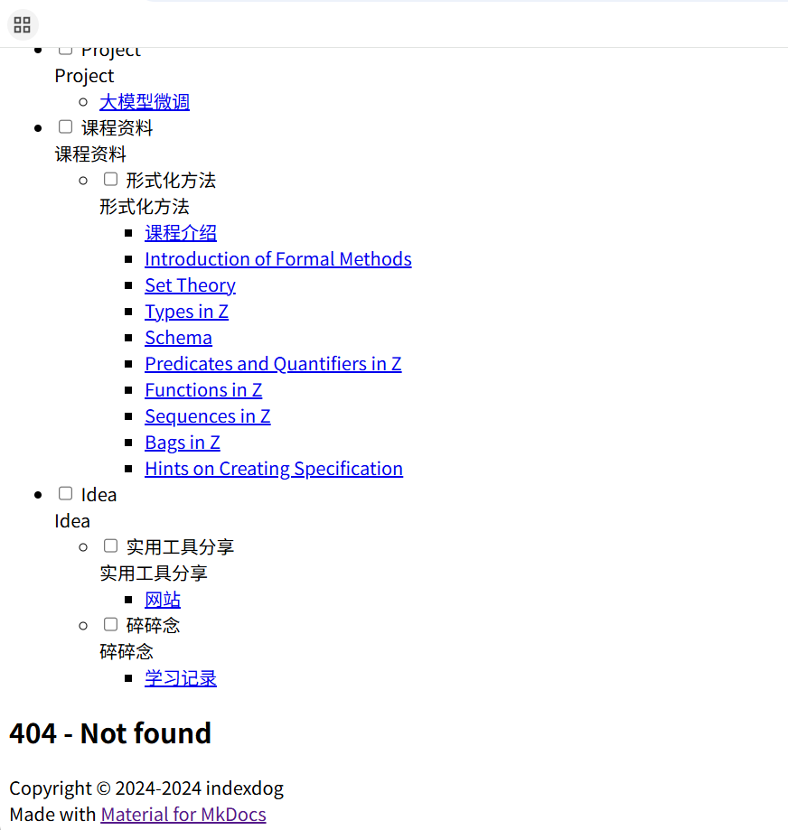

#### 插入图片

error: 编辑器里带网址的图片打不开
解决方法：点击图片链接在浏览器打开后再复制

使用 Markdown 而不是 HTML，将按预期工作：
 ``

>Markdown 允许文档作者在 Markdown 语法无法满足作者的需求时回退到原始 HTML。MkDocs 在这方面不限制 Markdown。但是，由于 Markdown 解析器会忽略所有原始 HTML，因此 MkDocs 无法验证或转换原始 HTML 中包含的链接。在原始 HTML 中包含内部链接时，您需要为呈现的文档手动设置适当的链接格式。

参考：https://stackoverflow.com/questions/71074662/configuring-image-filepaths-correctly-in-mkdocs/71083184#71083184

#### 插入音频

##### 音频形式（固定）

如下：

<audio controls>
  <source src="http://music.163.com/song/media/outer/url?id=1453946527.mp3" type="audio/mpeg">
  您的浏览器不支持音频元素。
</audio>


在自己需要的markdown文档中嵌入HTML代码

代码：

```html
<audio controls>
  <source src="http://music.163.com/song/media/outer/url?id=1453946527.mp3" type="audio/mpeg">
  您的浏览器不支持音频元素。
</audio>
```

其中`id=1453946527.mp3`替换成歌曲id

##### 网易云播放器形式（固定）

如下：

<iframe
    frameborder="no"
    border="0"
    marginwidth="0"
    marginheight="0"
    width=330
    height=86
    src="https://music.163.com/outchain/player?type=2&id=1453946527&auto=1&height=66">
</iframe>


代码：

```html
<iframe
    frameborder="no"
    border="0"
    marginwidth="0"
    marginheight="0"
    width=330
    height=86
    src="https://music.163.com/outchain/player?type=2&id=1453946527&auto=1&height=66">
</iframe>
```

同样替换id就好啦！

注：这里要注意有时候没有显示原因是使用了src相对路径，要替换成加域名的完整路径 

#####  添加自定义样式（固定）

如果播放器显示后需要调整外观，可以在 `docs/assets/css/style.css` 中添加自定义样式。例如：

```css
iframe {
    margin: 20px auto;
    display: block;
    border-radius: 8px;
    overflow: hidden;
}
```

然后在 `mkdocs.yml` 中加载该样式文件：

```yaml
extra_css:
  - assets/css/style.css
```


#### 点击跳转网站

  格式：`[描述](网址)`
  例：`[OCS网课助手](https://docs.ocsjs.com/docs/script/)`
  实现：[OCS网课助手](https://docs.ocsjs.com/docs/script/)

#### 点击跳转文章

  如果想在文章中引用自己的另一篇文章内容，有两种方法：本地引用（相对路径）和网址引用（绝对路径）。

#####  1. 使用本地引用（相对路径）

如果两篇文章位于同一个文件夹中，可以直接使用相对路径来引用。这种方式的优点是简洁且不依赖外部链接，即使网站的域名发生变化，链接仍然有效。

*  示例：

假设你的文件夹结构如下：


```
网站根目录/
   ├── 文章1.html
   ├── 文章2.html
```


在`文章1.html`中引用`文章2.html`，可以这样写：


* HTML：

```html
<a href="文章2.html">文章2</a>
```


或者在Markdown中：

* markdown

```markdown
[文章2](文章2.html)
```

##### 2. 使用网址引用（绝对路径）

如果你希望引用的链接更加明确，或者未来可能会将文件移动到其他位置，也可以使用绝对路径。绝对路径是从网站根目录开始的完整路径。

* 示例：

假设你的网站域名是`https://yourdomain.com`，文件夹结构如上，那么在`文章1.html`中引用`文章2.html`，可以这样写：

* HTML

```html
<a href="https://yourdomain.com/文章2.html">文章2</a>
```

或者在Markdown中：

* markdown

```markdown
[文章2](https://yourdomain.com/文章2.html)
```

***推荐使用本地引用（相对路径）***

- **优点**：
  - 更灵活：如果未来你更改了网站的域名，相对路径仍然有效。
  - 更简洁：代码更简洁，易于维护。
- **缺点**：
  - 如果文件被移动到其他文件夹，需要更新链接。

如果文件结构稳定，且你希望减少维护成本，推荐使用本地引用（相对路径）。

#### 遇到乱序问题
有可能是缩进不规范，一定要注意缩进！
如果web还是不更新可以退出浏览器再进入，可能是浏览器的缓存问题。


