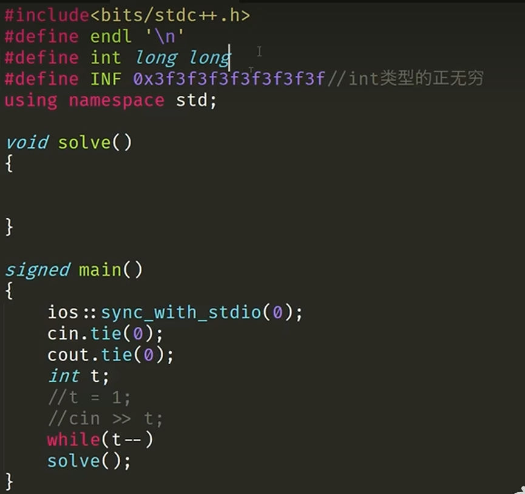

## 蓝桥杯中的常见“坑点”
1. main函数里必须在结尾 `return 0;`
2. 一定要开`long long` 1e6*1e6=1e12(超出了int)   
 **step1:把main函数前面的int换成signed**
 **step2:在代码开头,写上`#define int long long`**
(这样做完之后,代码中的所有`int`都会被替换成`long long`)
3. 关于输入输出的速度问题: 
(1)都用C语言的输入输出方式。 
(2)写上三行代码关流,同时写上`#define endl'\n'`
```cpp
ios :: sync_with_stdio(0);
cin.tie(0);
cout.tie(0);
//两种方式不要混用,因为在你写上三行代码的同时,虽然提高了cin,cout的速度,但是会导致scanf和printf出现Bug,导致输入输出错误。
```
4. 万能头文件: `#include<bits/stdc++.h>`

5. 提交代码时,会让你选择对应的C++标准,选择的规则:提交时的标准要大于等于你本地编译器中C++的标准。
### 苯人的坑：
1.用STL函数时一定记得写括号！


### 模板

```cpp
#include<bits/stdc++.h>
#define endl '\n'
#define int long long
#define INF 0x3f3f3f3f3f3f3f3f
using namespace std;

void solve(){

}

signed main(){
    ios::sync_with_stdio(0);
    cin.tie(0);
    cout.tie(0);
    int t;
    while(t--){
        solve();
    }
    return 0;
}
```