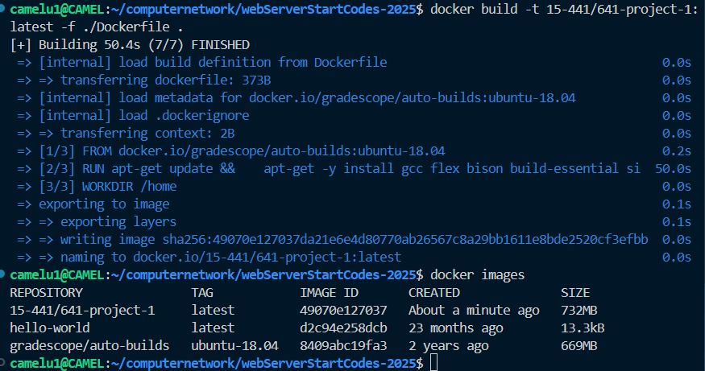
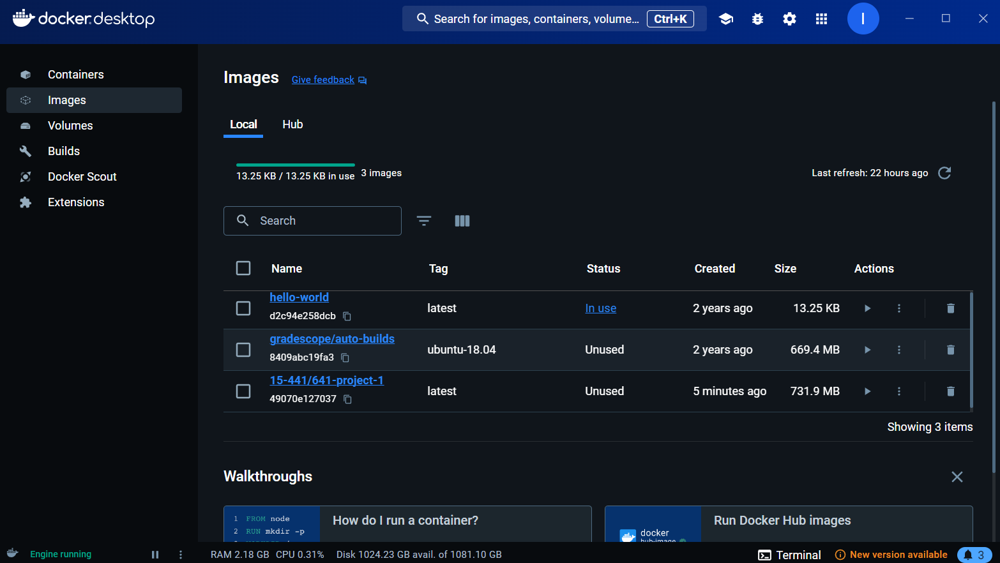

## 通过wsl部署docker

### 下载docker

下载docker desktop：https://docs.docker.com/get-docker/

安装好docker后，在命令行输入 `docker` ，可以看到docker的一些命令使用方法；或者输入`docker -v`，可以看到docker的版本号。

这证明docker已经安装成功了。

### 进入项目文件夹

* 项目文件夹中要有dockerfile，关于dockerfile，见[Docker Dockerfile](dockerfile0.md)

* 安装`docker-buildx` 插件：

  ```bash
  mkdir -p ~/.docker/cli-plugins
  curl -L https://github.com/docker/buildx/releases/download/v0.10.4/buildx-v0.10.4.linux-amd64 -o ~/.docker/cli-plugins/docker-buildx
  chmod +x ~/.docker/cli-plugins/docker-buildx
  ```

* 拉取镜像到本地

  运行:

  ````bash
  docker pull gradescope/auto-builds:ubuntu-18.04
  ````

  再运行下一步`build`，这样就不会出现无法从 Docker Hub 获取镜像的的错误。（实在不行多换几个源）

* 创建镜像:

  拿***CMU 15-441/641 Networking and the Internet Project 1: A Web Server Called Liso*** 项目举例：

  ```bash
  docker build -t 15-441/641-project-1:latest -f ./Dockerfile .
  ```

  >docker build 创建镜像
  >
  >-t name:tag  镜像名称 : 标签 
  >
  >(latest  这是镜像的标签（tag）。标签用于区分同一镜像的不同版本。`latest` 是默认标签，表示“最新版本”。你可以使用其他标签，例如 `v1`、`v2` 等。)
  >
  >-f 指定要使用的DockerFile路径
  >
  >. Dockerfile 文件所在目录，可以指定Dockerfile 的绝对路径

* 成功截图：
  


* docker desktop的images中也会显示对应的镜像
  


* 启动容器：

  ```bash
  docker run -it -v /home/camelu1/computernetwork/webServerStartCodes-2025/:/home/project-1/ --name Liso 15-441/641-project-1 /bin/bash
  ```

  >docker run -it -v /home/camelu1/computernetwork/webServerStartCodes-2025/:/home/project-1/ --name Liso 15-441/641-project-1 /bin/bash
  >
  >docker run -it -v           宿主机路径        :    容器路径  --name 容器名      镜像名    /bin/bash
  >
  >
  >
  >docker run 启动容器
  >
  >-it /bin/bash 使用终端交互式运行
  >
  >-v 数据卷（共享文件夹）
  >
  >--name  容器名

* 

* 如果在下次启动时要重新启动原容器，而不是重新运行一个同名的容器。运行以下命令：

  你可以使用 `docker start` 和 `docker attach` 命令来重新启动并进入容器。

  1. **启动容器**
     使用以下命令启动容器：

     ```bash
     docker start 80b6a95974fdc7e8b58680a928db64f0a0f110822a5ae6c37219f3eae6e13ec3
     ```

     或者使用容器的名称：

     ```bash
     docker start Liso
     ```

  2. **进入容器**
     容器启动后，使用以下命令进入容器：

     ```bash
     docker attach 80b6a95974fdc7e8b58680a928db64f0a0f110822a5ae6c37219f3eae6e13ec3
     ```

     或者：

     ```bash
     docker attach Liso
     ```

* 如果想重新运行一个同名的容器，你需要先删除或重命名现有的同名容器。

  1. **删除现有的容器**
     使用以下命令删除现有的容器：

     ```bash
     docker rm 80b6a95974fdc7e8b58680a928db64f0a0f110822a5ae6c37219f3eae6e13ec3
     ```

     或者：

     ```bash
     docker rm Liso
     ```

  2. **重新运行新的容器**
     删除后，你可以重新运行新的容器：

     ```bash
     docker run -it -v /home/camelu1/computernetwork/webServerStartCodes-2025/:/home/project-1/ --name Liso 15-441/641-project-1 /bin/bash
     ```

* 可以使用以下命令查看所有容器的状态：

  ```bash
  docker ps -a
  ```
