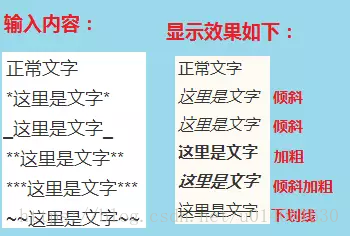
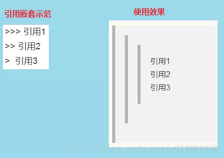
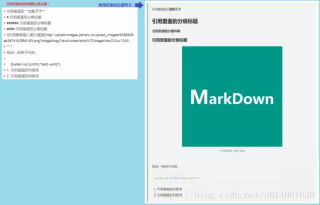

# Markdown语法图文全面详解

### 1. 快捷键

| 功能     | 快捷键   |
| -------- | -------- |
| 加粗     | Ctrl + B |
| 斜体     | Ctrl + I |
| 引用     | Ctrl + Q |
| 插入链接 | Ctrl + L |
| 插入代码 | Ctrl + K |
| 插入图片 | Ctrl + G |
| 提升标题 | Ctrl + H |
| 有序列表 | Ctrl + O |
| 无序列表 | Ctrl + U |
| 横线     | Ctrl + R |
| 撤销     | Ctrl + Z |
| 重做     | Ctrl + Y |

### 2. 基本语法

#### 2.1 字体设置斜体、粗体、删除线

*这里是文字*
_这里是文字_
**这里是文字**
***这里是文字***
~~这里是文字~~

#### 2.4 分割线

你可以在一行中用三个以上的星号(*)、减号(-)、底线(_)来建立一个分隔线，行内不能有其他东西。你也可以在星号或是减号中间插入空格。

#### 2.5 代码块

对于程序员来说这个功能是必不可少的，插入程序代码的方式有两种，一种是利用缩进(tab), 另一种是利用英文“`”符号（一般在ESC键下方，和~同一个键）包裹代码。

（1）代码块：缩进 4 个空格或是 1 个制表符。效果如下：

（2）行内式：如果在一个行内需要引用代码，只要用反引号`引起来就好（一般在ESC键下方，和~同一个键）

（3）多行代码块与语法高亮：在需要高亮的代码块的前一行及后一行使用三个单反引号“`”包裹，就可以了。
示例如下：

（4）代码块里面包含html代码
在代码区块里面， & 、 < 和 > 会自动转成 HTML 实体，这样的方式让你非常容易使用 Markdown 插入范例用的 HTML 原始码，只需要复制贴上，剩下的 Markdown 都会帮你处理。

**注意：简书代码块里不支持html。**

#### 2.6 引用

[跳转到目录](https://blog.csdn.net/u014061630/article/details/81359144?spm=1001.2014.3001.5506#00)
在被引用的文本前加上>符号，以及一个空格就可以了，如果只输入了一个>符号会产生一个空白的引用。

（1）基本使用
使用如下图所示：

（2）引用的嵌套使用
使用如图所示：

（3）引用其它要素
引用的区块内也可以使用其他的 Markdown 语法，包括标题、列表、代码区块等。
使用如图所示：1

