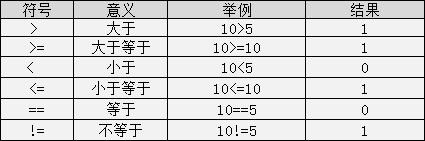
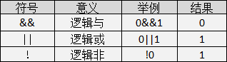
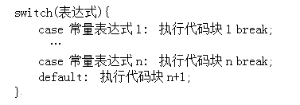

## C语法

#### hello,world

```c
#include<stdio.h> 
int main()
{
    /*在双引号中间输入Hello World*/ 
    printf("Hello World");
    
    return 0; 
}
```

#### 注释（cpp）

注释是写给程序员看的，不是写给电脑看的。

C语言注释方法有两种：

> 多行注释： `/* 注释内容 */`

> 单行注释： `//注释一行`

#### 标识符（cpp）

C语言规定，标识符可以是字母(A～Z，a～z)、数字(0～9)、下划线_组成的字符串，并且第一个字符必须是字母或下划线。在使用标识符时还有注意以下几点：

1.标识符的长度最好不要超过8位，因为在某些版本的C中规定标识符前8位有效，当两个标识符前8位相同时，则被认为是同一个标识符。
2.标识符是严格区分大小写的。例如Imooc和imooc 是两个不同的标识符。
3.标识符最好选择有意义的英文单词组成做到"见名知意"，不要使用中文。
4.标识符不能是C语言的关键字。

#### 变量及赋值

**注意:在定义中不允许连续赋值，如`int a=b=c=5;`是不合法的。**

#### 基本数据类型

C语言中，数据类型可分为：

基本数据类型
构造数据类型
指针类型
空类型四大类

因为精度的不同又分为3种(float,double,long double)：


注：**C语言中不存在字符串变量，字符串只能存在字符数组中,**这个后面会讲。


#### 格式化输出语句

格式化输出语句，也可以说是**占位输出**，是将各种类型的数据按照**格式化后的类型及指定的位置**从计算机上显示。

其格式为：`printf("输出格式符"，输出项)`;吧


当输出语句中包含普通字符时，可以采用一下格式：

```c
printf("普通字符输出格式符", 输出项);
1
```


注意：**格式符**的**个数**要与**变量、常量或者表达式的个数一**一对应

#### 不可改变的常量

在程序执行过程中，值不发生改变的量称为**常量**。

mtianyan: C语言的常量可以分为**直接常量和符号常量。**

- 直接常量也称为

  字面量

  ，是可以直接拿来使用，无需说明的量，比如：

  - 整型常量：13、0、-13；
  - 实型常量：13.33、-24.4；
  - 字符常量：‘a’、‘M’
  - 字符串常量：”I love imooc!”


在C语言中，可以用一个标识符来表示一个常量，称之为符号常量。符号常量在使用之前必须先定义，其一般形式为：

```c
#define 标识符 常量值 
```

```c
#include <stdio.h>
#define POCKETMONEY 10    //定义常量及常量值
int main()
{
    // POCKETMONEY = 12;  //小明私自增加零花钱对吗？
    printf("小明今天又得到%d元零花钱\n", POCKETMONEY);
    return 0;  
}

```

符号常量不可以被改变。

#### 自动类型转换

数据类型存在自动转换的情况.
自动转换发生在**不同数据类型**运算时，在编译的时候**自动完成**。


`char`类型数据转换为`int`类型数据遵循`ASCII`码中的对应值.

**注:**

> 字节小的可以向字节大的自动转换，但字节大的不能向字节小的自动转换

> char可以转换为int，int可以转换为double，char可以转换为double。但是不可以反向。

#### 强制类型转换

强制类型转换是通过**定义类型转换运算**来实现的。其一般形式为：

```c
(数据类型) (表达式)
```

其作用是把表达式的运算结果强制转换成**类型说明符所表示的类型**

**在使用强制转换时应注意以下问题：**


1.数据类型和表达式都必须加括号, 如把`(int)(x/2+y)`写成`(int)x/2+y`则成了把`x`转换成`int`型之后再除`2`再与`y`相加了。

2.**转换后不会改变原数据的类型及变量值，只在本次运算中临时性转换**。

3.强制转换后的运算结果**不遵循四舍五入**原则。

#### 运算符号 (cpp)

##### 算术运算符

c语言**基本运算符:**


**除法**运算中**注意**：

> 如果相除的两个数都是整数的话，则结果也为整数，**小数部分省略**，如`8/3 = 2`;

> 而两数中有一个为小数，结果则为小数，如：`9.0/2 = 4.500000`。

 **取余**运算中**注意**：

> 该运算只适合用**两个整数**进行取余运算，如：`10%3 = 1`；

> mtianyan: notes: 而10.0%3则是错误的；**运算后的符号取决于被模数的符号**，如`(-10)%3 = -1;`而`10%(-3) = 1;`

mtianyan: `%%`表示这里就是一个`%`符.

注：**C语言中没有乘方这个运算符**，也不能用`×, ÷`等算术符号。

##### 自增与自减运算符

- 自增运算符为`++`，其功能是使变量的值自增1
- 自减运算符为`--`，其功能是使变量值自减1。


##### 赋值运算符

C语言中赋值运算符分为**简单赋值运算符**和**复合赋值运算符**

简单赋值运算符`=`号了，下面讲一下复合赋值运算符：

复合赋值运算符就是在简单赋值符`=`之前加上其它运算符构成.

> 例如`+=、-=、*=、/=、%=`

分析：定义整型变量a并赋值为3，`a += 5;`这个算式就等价于`a = a+5;` 将变量a和5相加之后再赋值给a

注意：复合运算符中**运算符和等号**之间是**不存在空格**的。

##### 关系运算符

C语言中的**关系运算符**:



关系表达式的值是`真`和`假`，在C程序用整数`1`和`0`表示。

注意：`>=, <=, ==, !=`这种符号之间**不能存在空格**。

##### 逻辑运算符

C语言中的逻辑运算符:



逻辑运算的值也是有两种分别为`真`和`假`，C语言中用整型的1和0来表示。其求值规则如下：

- 与运算 `&&`

> 参与运算的两个变量都为真时，结果才为真，否则为假。例如：5>=5 && 7>5 ，运算结果为真；

- 或运算 `||`

> 参与运算的两个变量只要有一个为真，结果就为真。 两个量都为假时，结果为假。例如：5>=5||5>8，运算结果为真；

- 非运算`!`

> 参与运算的变量为真时，结果为假；参与运算量为假时，结果为真。例如：!(5>8)，运算结果为真。

##### 三目运算符

C语言中的三目运算符：`?:`，其格式为：

```
表达式1 ? 表达式2 : 表达式3; 
```

执行过程是：

> 先判断表达式1的值是否为真，如果是真的话执行表达式2；如果是假的话执行表达式3。

```c
#include <stdio.h>
int main()
{
    //定义小编兜里的钱
    double money =12.0      ; 
    //定义打车回家的费用
    double cost =11.5       ;  
    printf("小编能不能打车回家呢："); 
    //输出y小编就打车回家了，输出n小编就不能打车回家
    printf("%c\n",money>=cost?'y':'n'                        );
    return 0;
}

```

##### 运算符大比拼之优先级比较

各种运算符号的顺序:


**优先级别为1的优先级最高**，优先级别为10的优先级别最低。

#### 分支结构之嵌套if-else语句（cpp）

#### 循环结构之while循环（cpp）

while语句的语义是：计算表达式的值，当值为`真(非0)`时， 执行循环体代码块。


1.while语句中的表达式一般是关系表达或逻辑表达式，当表达式的值为假时不执行循环体，反之则循环体一直执行。

2.一定要记着在循环体中改变循环变量的值，否则会出现死循环（无休止的执行）。

3.循环体如果包括有一个以上的语句，则必须用`{}`括起来，组成复合语句。

#### 循环结构之do-while循环（cpp）

C语言中的`do-while`循环，一般形式如下：


do-while循环语句的语义是:

> 它先执行循环中的执行代码块，然后再判断while中表达式是否为真，如果为真则继续循环；如果为假，则终止循环。因此，**do-while循环至少要执行一次循环语句**。

注意：mtianyan: 使用`do-while`结构语句时，**while括号后必须有分号。**

#### 循环结构之for循环(一)（cpp）

c语言中**for循环**一般形式：


它的执行过程如下：

执行表达式1，对循环变量做初始化；
判断表达式2，若其值为真(非0)，则执行for循环体中执行代码块，然后向下执行；若其值为假(0)，则结束循环;
执行表达式3，(i++)等对于循环变量进行操作的语句;
执行for循环中执行代码块后执行第二步;第一步初始化只会执行一次。
循环结束，程序继续向下执行。

注意：for循环中的**两个分号**一定要写

#### 循环结构之for循环(二)（cpp）

在for循环中:

- 表达式1是一个或多个**赋值语句**，它用来控制变量的**初始值**；
- 表达式2是一个**关系表达式**，它决定什么时候退出循环；
- 表达式3是**循环变量的步进值**，定义控制循环变量每循环一次后按什么方式变化。
- 这三部分之间用分号 `;` 分开。

使用for语句应该**注意**：

for循环中的“表达式1、2、3”均可不写为空，但两个分号(;;)不能缺省。

省略“表达式1（循环变量赋初值）”，表示不对循环变量赋初始值。

省略“表达式2(循环条件)”，不做其它处理，循环一直执行（死循环）。

省略“表达式3(循环变量增减量)”，不做其他处理，循环一直执行（死循环）。

表达式1可以是设置循环变量的初值的赋值表达式，也可以是其他表达式。

表达式1和表达式3可以是一个简单表达式也可以是多个表达式以逗号分割。

表达式2一般是**关系表达式**或**逻辑表达式**，但也可是数值表达式或字符表达式，**只要其值非零**，就执行循环体。

各表达式中的变量一定要在for循环**之前定义**。

##### 怎么获得一个数的百位，十位和个位(cpp)

- 百位数：`num/100` 可以获得，因为 `int` 是整数型，小数部分会省略。比如 `765/100` 的结果是`7`
- 十位数：`num%100/10` 。比如`765%100`先得到`65`，`65/10`得到`6`
- 个位数：`num%10`。`765%10`得到`5`

#### 结束语句之break语句(cpp)

那么循环5次的时候，需要中断不继续训练。在C语言中，可以使用`break`语句进行该操作.

使用`break`语句时注意以下几点：

> 1. 在没有循环结构的情况下，break不能用在单独的if-else语句中。

2 .在多层循环中，一个break语句只跳出当前循环。

#### 结束语句之continue语句(cpp)

那么循环5次的时候，需要中断后继续训练。在C语言中，可以使用continue语句进行该操作

`continue语句的作用是结束本次循环开始执行下一次循环。`

break语句与continue语句的区别是:

`break是跳出当前整个循环，continue是结束本次循环开始下一次循环。`

#### 分支结构之switch语句(cpp)



`switch`语句时还应**注意**以下几点：

1. 在case后的各**常量表达式**的值不能相同，否则会出现错误。

2. 在case子句后如果没有**break**;会一直往后执行**一直到遇到break;**才会跳出switch语句。

3. switch后面的表达式语句只能是**整型**或者**字符类型**。

4. 在case后，允许有多个语句，**可以不用{}**括起来。

5. 各case和default子句的先后顺序可以变动，而不会影响程序执行结果。

6. `default`子句可以省略不用。

#### 臭名远扬之goto语句(cpp)


#### 自创函数(cpp)

1. `[]` 包含的内容可以省略，数据类型说明省略，默认是 `int` 类型函数; 参数省略表示该函数是**无参函数**，参数不省略表示该函数是**有参函数**;
2. 函数名称遵循**标识符命名规范；**

3. 自定义函数尽量放在 `main` 函数之前，如果要**放在main函数后面的话**, 需要在main函数之前**先声明**自定义函数，声明格式为：

```c
[数据类型说明] 函数名称（[参数]）;
```

#### 变量存储类别

C语言中存储类别又分为四类：

- 自动（auto）、
- 静态（static）、
- 寄存器的（register）
- 外部的（extern）。

1、用关键字auto定义的变量为自动变量，auto可以省略，auto不写则隐含定为“自动存储类别”，属于动态存储方式。如：


2、用static修饰的为静态变量，如果定义在函数内部的，称之为静态局部变量；如果定义在函数外部，称之为静态外部变量。如下为静态局部变量：


注意：静态局部变量属于静态存储类别，在静态存储区内分配存储单元，在程序整个运行期间都不释放；静态局部变量在编译时赋初值，即只赋初值一次；如果在定义局部变量时不赋初值的话，则对静态局部变量来说，编译时自动赋初值0（对数值型变量）或空字符（对字符变量）。

3、为了提高效率，C语言允许将局部变量得值放在CPU中的寄存器中，这种变量叫“寄存器变量”，用关键字register作声明。例如：


 注意：只有局部自动变量和形式参数可以作为寄存器变量；一个计算机系统中的寄存器数目有限，不能定义任意多个寄存器变量；**局部静态变量不能定义为寄存器变量。**

4、用extern声明的的变量是外部变量，外部变量的意义是某函数可以调用在该函数之后定义的变量。如：


#### 内部函数与外部函数

- 在C语言中不能被其他源文件调用的函数称谓内部函数 ，内部函数由static关键字来定义，因此又被称谓静态函数，形式为：
  static [数据类型] 函数名（[参数]）

- 这里的static是对函数的作用范围的一个限定，限定该函数只能在其所处的源文件中使用，因此在不同文件中出现相同的函数名称的内部函数是没有问题的。

- 在C语言中能被其他源文件调用的函数称谓外部函数 ，外部函数由extern关键字来定义，形式为：
  extern [数据类型] 函数名([参数])

- C语言规定，在没有指定函数的作用范围时，系统会默认认为是外部函数，因此当需要定义外部函数时extern也可以省略。

静态变量只赋值一次

#### 数组初体验(cpp)


数据类型 数组名称[长度n] = {元素1,元素2…元素n};

数据类型 数组名称[] = {元素1,元素2…元素n};

数据类型 数组名称[长度n]; 数组名称[0] = 元素1; 数组名称[1] = 元素2; 数组名称[n-1] = 元素n;

#### 数组的遍历

注意以下几点：

1. 最好**避免出现数组越界访问**，循环变量最好不要超出数组的长度.
2. **C语言的数组长度一经声明，长度就是固定，无法改变**，并且**C语言并不提供计算数组长度的方法**。

由于C语言是没有检查数组长度改变或者数组越界的这个机制，可能会在编辑器中编译并通过，但是结果就不能肯定了，因此还是不要越界或者改变数组的长度

c语言获取数组长度

```c
int length = sizeof(arr)/sizeof(arr[0]);
```

#### 数组作为函数参数

数组可以由整个数组当作函数的参数，也可以由数组中的某个元素当作函数的参数：

数组作为函数参数时注意以下事项：

1. 数组名作为函数实参传递时，函数定义处作为接收参数的数组类型形参既可以指定长度也可以不指定长度。
2. 数组元素作为函数实参传递时，数组元素类型必须与形参数据类型一致。

#### 字符串与数组

C语言中，是没有办法直接定义字符串数据类型的，但是我们可以使用数组来定义我们所要的字符串。一般有以下两种格式：

1. char 字符串名称[长度] = “字符串值”;
2. char 字符串名称[长度] = {‘字符1’,‘字符2’,…,‘字符n’,’\0’};

注意：

1. []中的长度是可以省略不写的；
2. 采用第2种方式的时候最后一个元素必须是’\0’，’\0’表示字符串的结束标志；
3. 采用第2种方式的时候在数组中不能写中文。
   在输出字符串的时候要使用：`printf(“%s”,字符数组名字);`或者`puts(字符数组名字)`;。

#### 字符串函数

常用的字符串函数如下(strlen,strcmp,strcpy,strcat,atoi):


#### 多维数组(cpp)


## 应用

#### 数组的应用（一）[冒泡排序]

以升序排序为例冒泡排序的思想：相邻元素两两比较，将较大的数字放在后面，直到将所有数字全部排序。就像小学排队时按大小个排一样，将一个同学拉出来和后面的比比，如果高就放后面，一直把队伍排好。

```c
#include <stdio.h>
int main()
{
    double arr[]={1.78, 1.77, 1.82, 1.79, 1.85, 1.75, 1.86, 1.77, 1.81, 1.80};
    int i,j;
    printf("\n************排队前*************\n");
    for(i=0;i<10;i++)
    {
        if(i != 9)   
            printf("%1.2f, ", arr[i]);  //%1.2f表示小数点前一位，小数点后精确到两位
        else
            printf("%1.2f", arr[i]);    //%1.2f表示小数点前一位，小数点后精确到两位
    }
    for(i=8; i>=0; i--)
    {
        for(j=0;j<=i;j++)
        {
            if( arr[j]>arr[j+1])      //当前面的数比后面的数大时
            {
                double temp;    //定义临时变量temp
                temp=arr[j];//将前面的数赋值给temp
                arr[j]=arr[j+1];             //前后之数颠倒位置
                arr[j+1]=temp;//将较大的数放在后面    
            }                 
        }                
    }
    printf("\n************排队后*************\n");
    for(i=0;i<10;i++)
    {
        if(i != 9)   
            printf("%1.2f, ", arr[i]);  //%1.2f表示小数点前一位，小数点后精确到两位     
        else
            printf("%1.2f", arr[i]);    //%1.2f表示小数点前一位，小数点后精确到两位
    }
    return 0;    
}

```

#### 数组的应用（二）[数组查找功能]

当我们购物之后，拎着购物袋回到家，会一一检查购物袋中的物品看是否缺少或者都是想购之物。

那么应用到程序中，可以使用数组查找功能，看看是否存在该数据，如果存在并返回该元素的下标。

```c
#include <stdio.h>
int getIndex(int arr[5],int value)
{
    int i;
    int index;
    for(i=0;i<5;i++)
    {
       /* 请完善数组查询功能 */
       if(arr[i]==value)
        {
            index=i;
            break;
        }  
       index=-1;
    }
    return index;
}

int main()
{
    int arr[5]={3,12,9,8,6};
    int value = 8;
    int index = getIndex(arr,value);      //这里应该传什么参数呢？
    if(index!=-1)
    {
        printf("%d在数组中存在，下标为：%d\n",value,index);             
    }
    else
    {
        printf("%d在数组中不存在。\n",value);    
    }
    return 0;    
}

```

#### 多维数组的遍历

```c
#include <stdio.h>
#define N 10
//打印分数 
void printScore(int score[])
{
	int i;
	printf("\n");
	for(i=0;i<N;i++)
	{
		printf("%d ",score[i]);               
	}
	printf("\n");     
}
//计算考试总分 
int getTotalScore(int score[])
{
	int sum = 0;
	int i;
	for(i=0;i<N;i++)
	{
		sum+=score[i];                
	} 
	return sum;
}
//计算平均分 
int getAvgScore(int score[])
{
	return getTotalScore(score)/N;   
}
//计算最高分 
int getMax(int score[])
{
	int max = -1;
	int i;
	for(i=0;i<N;i++)
	{
		if(score[i]>max)
		{
			max = score[i];              
		}                
	} 
	return max;
}
//计算最低分 
int getMin(int score[])
{
	int min =100;
	int i;
	for(i=0;i<N;i++)
	{
		if(score[i]< min)
		{
			min = score[i];              
		}                
	} 
	return min;
}
//分数降序排序 
void sort(int score[])
{
	int i,j;
	for(i=N-2;i>=0;i--)
	{
		for(j=0;j<=i;j++)
		{
			if(score[j]<score[j+1])
			{
				int temp;
				temp = score[j];
				score[j] = score[j+1]; 
				score[j+1]=temp;                  
			}                 
		}                   
	}
	printScore(score);     
}

int main()
{
	int score[N]={67,98,75,63,82,79,81,91,66,84};
	int sum,avg,max,min;
	sum = getTotalScore(score);
	avg = getAvgScore(score);
	max = getMax(score);
	min = getMin(score);
	printf("总分是：%d\n",sum);
	printf("平均分是：%d\n",avg);
	printf("最高分是：%d\n",max);
	printf("最低分是：%d\n",min);
	printf("----------成绩排名---------\n");
	sort(score);
	return 0;    
}

```

